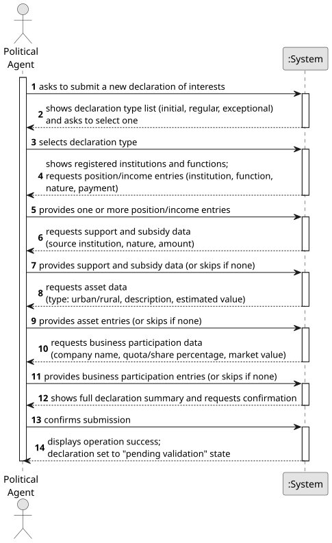

# US006 - Submit a Declaration of Interests

## 1. Requirements Engineering

### 1.1. User Story Description

As a Political Agent, I want to submit a declaration of interests including income, position/job/post (public, private, or social), assets, and business participations.

### 1.2. Customer Specifications and Clarifications

**From the specifications document:**

> Declarations of Interest may be initial, submitted by political agents whenever they begin a term of office; regular, submitted regularly (annually) while performing a political function; and exceptional, submitted whenever there is a significant change in the values mentioned in the declaration, when requested by the ethics committee, or for the purpose of correcting errors/omissions in previously submitted declarations.

> Declarations of interest must include information regarding:
> - professional positions, public, private, and social positions held (or previously held), in which institutions, the nature of these institutions, the functions performed, and the payment received;
> - support and subsidies received, from which institutions and the nature of the institution;
> - assets (real estate: urban and rural) with their estimated value;
> - quotas, shares, and holdings in companies, with their respective market values.

**From the client clarifications:**

> **Question:** What types of declaration can be submitted?
>
> **Answer:** A declaration can be of three types: initial (when beginning a term of office), regular (submitted annually), or exceptional (when significant changes occur or when requested by the ethics committee).

### 1.3. Acceptance Criteria

* **AC1:** All required fields must be filled in before submission.
* **AC2:** The declaration type must be selected from the predefined list: initial, regular, or exceptional.
* **AC3:** At least one income/position entry must be included in the declaration.
* **AC4:** Asset values and business participation market values must be non-negative numeric values.
* **AC5:** The declaration must be associated with the authenticated Political Agent and timestamped automatically by the system at the moment of submission.
* **AC6:** Upon successful submission, the declaration is placed in a "pending validation" state and is not yet publicly visible.

**_These ACs where determined without input from the client and might change when more question are asked_**

### 1.4. Found out Dependencies

* There is a dependency on **US01 - Request Registration** and **US02 - Accept/Reject Registration**, as the Political Agent must be registered and authenticated in the platform before submitting a declaration.
* There is a dependency on **US04 - Register an Institution** and **US05 - Register Functions**, as institutions and functions must exist in the system to be referenced in the declaration.

### 1.5. Input and Output Data

**Input Data:**

* Typed data:
    * payment/income amount(s) per position
    * support and subsidy amounts and sources
    * asset descriptions and estimated values (urban and rural real estate)
    * company names, quota/share percentages, and respective market values

* Selected data:
    * declaration type (initial, regular, or exceptional)
    * institution(s) associated with each position
    * function(s) performed per institution
    * nature of each position (public, private, or social)

**Output Data:**

* List of available declaration types
* List of registered institutions
* List of registered functions
* Summary of the submitted declaration
* (In)Success of the operation

### 1.6. System Sequence Diagram (SSD)

**_Other alternatives might exist._**

### 1.7. Other Relevant Remarks

* The submitted declaration is set to a **"pending validation"** state immediately after submission and remains invisible to the general public until validated by the Ethics Committee (see US008).
* Exceptional declarations must reference the declaration they are amending.
* The system must record the exact timestamp of submission for audit and temporal analysis purposes.
