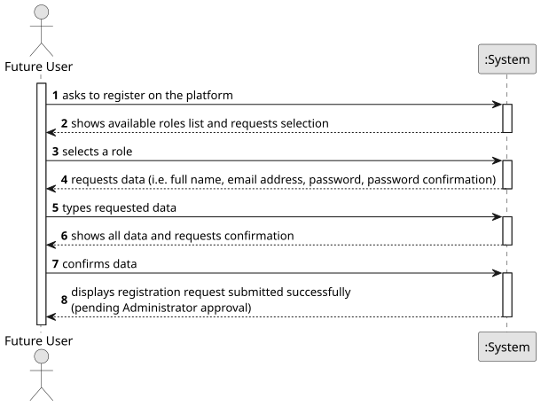

# US001 - Register on the Platform

## 1. Requirements Engineering

### 1.1. User Story Description

As a future user, I want to request to be registered in the platform with the appropriate permissions for a specific role.

---

### 1.2. Customer Specifications and Clarifications

**From the specifications document:**

> Each user must be authenticated with a password of seven alphanumeric characters, including three capital letters and two digits.

> The information provided varies depending on the type of user.

> Platform users may be: Political Agent, Ordinary Citizen, Journalist, Ethics Committee member, or System Administrator.

**From the client clarifications:**

> **Question:** Can a user hold more than one role simultaneously (e.g., being both a Journalist and an Ordinary Citizen)?
>
> **Answer:** No. Roles must not overlap. If a user needs more than one role, they must create separate registrations for each role.

> **Question:** What identification documents are required during registration, and does this vary by role?
>
> **Answer:** Yes, identification requirements vary by role. For Journalists, the system must validate their press card (cartão de jornalista) issued by the Journalists' Union. For Ordinary Citizens, a valid national identity card (cartão de cidadão) is required. Other roles follow standard identification procedures.

> **Question:** When a registration request is rejected, is the user informed of the reason?
>
> **Answer:** Yes. The Administrator must provide a reason when rejecting a registration request. Additionally, when a rejected user attempts to log in, the system must display a rejection notice along with the reason provided by the Administrator.

> **Question:** Can a user edit their registration request after submission?
>
> **Answer:** No. Once a registration request is submitted, it cannot be edited. If the user needs to correct any information, they must submit a new request.

> **Question:** What is the purpose of the platform and what kind of irregularities does it aim to detect?
>
> **Answer:** The platform supports the analysis of Declarations of Interests submitted by political agents. Its main goal is to detect irregularities such as conflicts of interest — for example, situations where a political agent holds shares in a company that benefits from their political decisions — and cases of illicit enrichment.

> **Question:** Does the Ethics Committee have any restrictions on what they can access on the platform?
>
> **Answer:** No. The Ethics Committee has full access to all information on the platform, including all submitted declarations, complaints, and user data.

---

### 1.3. Acceptance Criteria

* **AC1:** The role must be selected from a predefined list of available roles (Political Agent, Ordinary Citizen, Journalist, Ethics Committee member, System Administrator).
* **AC2:** All required fields must be filled in.
* **AC3:** The password must have exactly seven alphanumeric characters, including at least three capital letters and two digits.
* **AC4:** The registration request must be submitted to an Administrator for approval before access is granted.
* **AC5:** The system must not allow duplicate registrations for the same user identity within the same role.
* **AC6:** Journalists must provide a valid press card number during registration. Ordinary Citizens must provide a valid national identity card number.
* **AC7:** A user whose registration request has been rejected must be notified of the rejection reason upon attempting to log in.

---

### 1.4. Found out Dependencies

* There is a dependency on **US002 - Accept/Reject Registration Requests** as the registration only becomes active after an Administrator approves it.

---

### 1.5. Input and Output Data

**Input Data:**

* Typed data:
  * full name
  * email address
  * password (7 alphanumeric characters: ≥3 uppercase, ≥2 digits)
  * password confirmation
  * identification document number (press card for Journalists; national identity card for Citizens)

* Selected data:
  * role (from predefined list)

**Output Data:**

* List of available roles
* (In)Success of the registration request submission
* Confirmation message informing the user that the request is pending approval

---

### 1.6. System Sequence Diagram (SSD)

**_Other alternatives might exist._**

---

### 1.7. Other Relevant Remarks

* The registration request remains in a **Pending** state until reviewed by an Administrator (see US002).
* A user may hold multiple roles on the platform, but each role requires a separate and independent registration — roles must not overlap within a single account.
* When a registration request is rejected, the Administrator must supply a rejection reason. This reason is displayed to the user the next time they attempt to log in.
* Journalists may require additional validation via press card number — confirmed by the client.