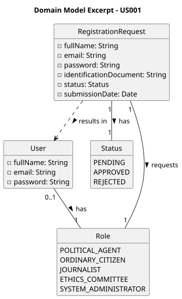

# US001 - Register on the Platform

## 2. Analysis

### 2.1. Relevant Domain Model Excerpt

To fulfill this requirement, the core concepts involved are `RegistrationRequest`, `Role`, and `User`.

A future user interacts with the system by submitting a `RegistrationRequest`, which encapsulates all the information provided during registration. This request is associated with a single `Role` chosen from a predefined list. The request remains in a **Pending** state until an Administrator reviews it (see US002).

The key entities and their attributes are:

* **RegistrationRequest:**
    * **fullName:** The full name of the applicant.
    * **email:** The email address of the applicant, used as a unique identifier.
    * **password:** A password with exactly seven alphanumeric characters, at least three uppercase letters, and at least two digits.
    * **role:** The selected role from the predefined list.
    * **identificationDocument:** A document number (press card for Journalists; national identity card for Ordinary Citizens).
    * **status:** The current state of the request (Pending, Approved, Rejected).
    * **submissionDate:** The date and time the request was submitted.

* **Role:** Represents one of the predefined roles available in the system (Political Agent, Ordinary Citizen, Journalist, Ethics Committee, System Administrator).

Business rules:
* The system must not allow duplicate registrations for the same user identity within the same role.
* Passwords must follow strict format rules (7 alphanumeric characters: ≥3 uppercase, ≥2 digits).
* Journalists must provide a press card number; Ordinary Citizens must provide a national identity card number.

### 2.2. Other Remarks

* The registration request is the only entry point for new users; no user account is created without going through this flow.
* A rejected request must store the reason provided by the Administrator, which will be shown to the user on their next login attempt.
* Persistence of `RegistrationRequest` and `Role` objects must be ensured through object serialization.
* This US is tightly coupled with **US002**, which handles the Administrator's review of pending requests.
