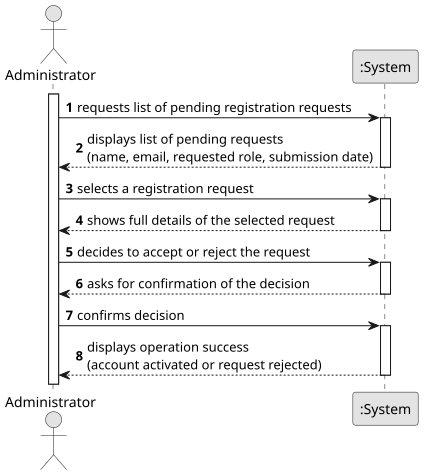

# US002 - Accept/Reject Registration Requests

## 1. Requirements Engineering

### 1.1. User Story Description

As an Administrator, I want to accept or reject registration requests on the platform, in order to control which users gain access and with what role.

---

### 1.2. Customer Specifications and Clarifications

**From the specifications document:**

> All those who wish to use the application must be authenticated with a password of seven alphanumeric characters, including three capital letters and two digits.

> This platform may be used by different users, namely: Political Agent, Ordinary Citizen, Journalist, Ethics Committee member, and System Administrator.

> The information provided varies depending on the type of user.

**From the client clarifications:**

> **Question:** When rejecting a registration request, is the Administrator required to provide a reason?
>
> **Answer:** Yes. The Administrator must always supply a reason when rejecting a registration request. This reason will be displayed to the user the next time they attempt to log in, so they understand why their request was denied.

> **Question:** Is the user notified of a rejection automatically, or only when they try to log in?
>
> **Answer:** The rejection notice is shown to the user when they attempt to log in. The system must display the rejection reason provided by the Administrator at that point.

> **Question:** Can a user hold more than one role? If so, how should the Administrator handle multiple pending requests from the same person?
>
> **Answer:** A user may register for more than one role, but each role requires a separate and independent registration. Roles must not overlap within a single account. The Administrator handles each registration request independently, even if they belong to the same person.

> **Question:** Does the Administrator need to validate the identification documents submitted during registration (e.g., press card for Journalists, national identity card for Citizens)?
>
> **Answer:** Yes. The Administrator must verify the identification document provided — a valid press card (cartão de jornalista) for Journalists and a valid national identity card (cartão de cidadão) for Ordinary Citizens — before accepting the request.

> **Question:** Can the Administrator edit the role or personal data of a registration request before accepting it?
>
> **Answer:** No. The Administrator cannot edit any data in a registration request. If the data is incorrect, the request must be rejected (with a reason), and the user must submit a new request with the correct information.

> **Question:** Does the Ethics Committee have any restrictions when it comes to accessing user registration data?
>
> **Answer:** No. The Ethics Committee has full access to all information on the platform, including registration and user data.

---

### 1.3. Acceptance Criteria

* **AC1:** The Administrator must be able to view a list of all pending registration requests.
* **AC2:** For each request, the Administrator must be able to choose to **Accept** or **Reject** it.
* **AC3:** When a request is accepted, the user account is activated with the requested role and the user may log in.
* **AC4:** When a request is rejected, the Administrator must provide a mandatory rejection reason. The user does not gain access to the platform and the request is archived.
* **AC5:** The Administrator must not be able to accept a request for a role that does not exist in the system's predefined list.
* **AC6:** The Administrator must verify the identification document of the registering user (press card for Journalists; national identity card for Ordinary Citizens) before accepting the request.
* **AC7:** The Administrator cannot edit any data within a registration request — only Accept or Reject.

---

### 1.4. Found out Dependencies

* There is a dependency on **US001 - Request Registration** as there must be at least one pending registration request for the Administrator to manage.

---

### 1.5. Input and Output Data

**Input Data:**

* Selected data:
  * a pending registration request (from the list)
  * a decision: Accept or Reject

* Typed data (only when rejecting):
  * rejection reason

**Output Data:**

* List of pending registration requests (name, email, requested role, identification document, submission date)
* (In)Success of the operation

---

### 1.6. System Sequence Diagram (SSD)

**_Other alternatives might exist._**

---

### 1.7. Other Relevant Remarks

* Only the System Administrator has the authority to accept or reject registration requests; no other role may perform this operation.
* A registration request remains in **Pending** state until an explicit decision (Accept or Reject) is made by the Administrator.
* When a request is rejected, the rejection reason is stored and displayed to the user upon their next login attempt.
* The Administrator cannot modify any registration data — if the data is invalid or incorrect, the request must be rejected so the user can submit a corrected one.
* Each registration request is handled independently, even if multiple requests belong to the same person (one per role).
* After acceptance, the newly activated user must authenticate using their registered password (7 alphanumeric characters including 3 uppercase letters and 2 digits).
* This US is closely coupled with **US001**: together they form the complete user onboarding flow of the platform.