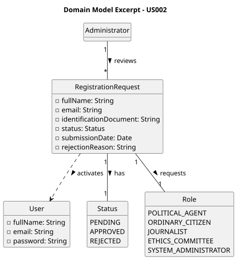

# US002 - Accept/Reject Registration Requests

## 2. Analysis

### 2.1. Relevant Domain Model Excerpt

To fulfill this requirement, the core concepts involved are `Administrator`, `RegistrationRequest`, `Role`, and `User`.

The `Administrator` is the sole actor with authority to review `RegistrationRequest` entries submitted by future users. For each pending request, the Administrator can either **accept** or **reject** it. Upon acceptance, a `User` account is activated with the requested `Role`. Upon rejection, a mandatory rejection reason is stored and associated with the request.

The key entities and their attributes are:

* **Administrator:** A special type of user with the authority to manage registration requests. No other role may perform this operation.

* **RegistrationRequest:**
    * **fullName:** The full name of the applicant.
    * **email:** The email address of the applicant.
    * **role:** The role requested by the applicant.
    * **identificationDocument:** Document provided for verification (press card for Journalists; national identity card for Ordinary Citizens).
    * **status:** The current state of the request (Pending, Approved, Rejected).
    * **submissionDate:** The date and time the request was submitted.
    * **rejectionReason:** Mandatory text provided by the Administrator when rejecting a request.

* **Role:** Represents one of the predefined roles in the system. The Administrator must ensure the requested role exists in the system before accepting the request.

Business rules:
* The Administrator cannot edit any data within a registration request only Accept or Reject.
* A rejection reason is mandatory when rejecting a request.
* The Administrator must verify the identification document before accepting (press card for Journalists; national identity card for Ordinary Citizens).
* Each registration request is handled independently, even if multiple requests belong to the same person.

### 2.2. Other Remarks

* A `RegistrationRequest` remains in **Pending** state until an explicit decision is made by the Administrator.
* The rejection reason is stored in the `RegistrationRequest` and displayed to the user upon their next login attempt.
* Persistence of `RegistrationRequest` and `User` objects must be ensured through object serialization.
* This US is tightly coupled with **US001**: together they form the complete user onboarding flow of the platform.
