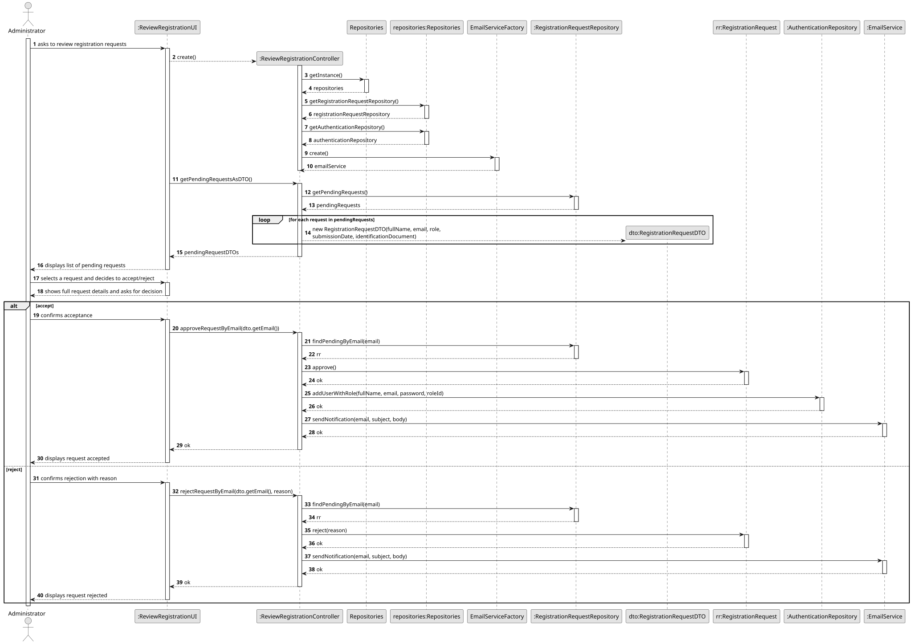
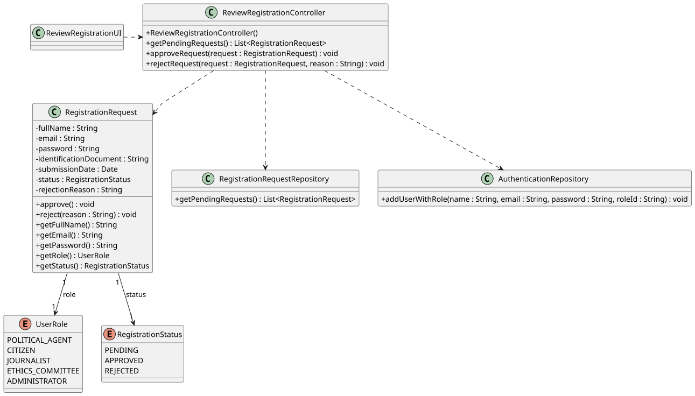

# US02 - Accept/Reject Registration Requests

## 3. Design

### 3.1. Rationale

**The rationale grounds on the SSD interactions and the identified input/output data.**

| Interaction ID | Question: Which class is responsible for...                                        | Answer                          | Justification (with patterns)                                                                                                                                      |
|:---------------|:-----------------------------------------------------------------------------------|:--------------------------------|:-------------------------------------------------------------------------------------------------------------------------------------------------------------------|
| Step 1         | ...interacting with the actor?                                                     | ReviewRegistrationUI            | **Pure Fabrication**: the UI has no business responsibilities; it only handles I/O with the Administrator.                                                         |
| Step 1         | ...coordinating the US?                                                            | ReviewRegistrationController    | **Controller**: decouples the UI from the domain and orchestrates the use case.                                                                                    |
| Step 2         | ...knowing all pending registration requests?                                      | RegistrationRequestRepository   | **Information Expert**: the repository holds all RegistrationRequest instances and knows how to filter by PENDING status.                                          |
| Step 3         | ...changing the status of a registration request to APPROVED?                      | RegistrationRequest             | **Information Expert**: the domain class owns its own state machine (PENDING → APPROVED/REJECTED) and enforces the invariant that only PENDING requests can change. |
| Step 3         | ...creating the user account when a request is approved?                           | AuthenticationRepository        | **Information Expert**: the authentication repository is responsible for managing user accounts and their roles.                                                   |
| Step 4         | ...changing the status of a registration request to REJECTED?                      | RegistrationRequest             | **Information Expert**: same rationale as approval; the domain class controls its own state transitions.                                                          |
| Step 5         | ...mapping a UserRole to the authentication system's role identifier?              | ReviewRegistrationController    | **Controller / Pure Fabrication**: isolates the mapping logic from both the UI and the domain, preventing coupling between UserRole and the auth system's strings. |
| Step 6         | ...informing operation (in)success?                                                | ReviewRegistrationUI            | **Information Expert**: the UI is responsible for user interactions and feedback.                                                                                  |
| Step 3/4       | ...sending the decision notification to the user?                                   | EmailService                    | **Polymorphism / Protected Variations**: an interface hides the concrete provider; the controller depends on the abstraction, not on a specific implementation.    |
| Step 3/4       | ...choosing the email provider defined in the configuration file?                   | EmailServiceFactory             | **Pure Fabrication / Factory**: isolates the logic that reads the config file and instantiates the right EmailService, keeping the controller free of that concern. |

### Systematization

According to the taken rationale, the conceptual classes promoted to software classes are:

* RegistrationRequest

Other software classes (i.e. Pure Fabrication) identified:

* ReviewRegistrationUI
* ReviewRegistrationController
* RegistrationRequestRepository
* AuthenticationRepository
* EmailService (interface)
* GmailEmailService
* DeiEmailService
* EmailServiceFactory

## 3.2. Sequence Diagram (SD)

## 3.3. Class Diagram (CD)

