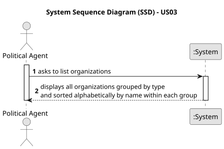

# US03 - List Organizations

## 1. Requirements Engineering

### 1.1. User Story Description

As a Political Agent, I want to list Organizations (Companies, Political Parties, Foundations, Institutes, Associations).

### 1.2. Customer Specifications and Clarifications

**From the specifications document:**

> Organizations represent entities that may be associated with a political agent's positions, business participations, or subsidy declarations. Organization types include: Company, Political Party, Foundation, Institute, and Association.

> The organizations should be grouped by type and then listed alphabetically by name.

**From the client clarifications:**

> **Question:** Should the list include all organizations in the system or only those associated with the logged-in Political Agent?
>
> **Answer:** The list must include all organizations registered in the system, regardless of any association with the logged-in Political Agent.

> **Question:** What are the valid organization types?
>
> **Answer:** The organization type must be selected from a predefined list: Company, Political Party, Foundation, Institute, or Association.

### 1.3. Acceptance Criteria

* **AC1:** The organizations must be grouped by type and then listed alphabetically by name within each group.
* **AC2:** Within each type group, organizations must be listed alphabetically by name.
* **AC3:** If no organizations are registered for a given type, that type group may be omitted or shown as empty.
* **AC4:** Only authenticated Political Agents may access this listing.

### 1.4. Found out Dependencies

* There is a dependency on **US04 - Register an Organization**, as organizations must first be registered before they can be listed.

### 1.5. Input and Output Data

**Input Data:**

* None (the listing is triggered by user action with no additional input required).

**Output Data:**

* List of all registered organizations, grouped by type and ordered alphabetically by name within each group.

### 1.6. System Sequence Diagram (SSD)

**_Other alternatives might exist._**

### 1.7. Other Relevant Remarks

* This US is read-only. No data is created, modified, or deleted.
* Organizations are referenced in Declarations of Interests submitted by Political Agents (professional positions, business participations, subsidy entries), which justifies the need for this listing.
