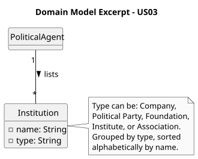

# US03 - List Institutions

## 2. Analysis

### 2.1. Relevant Domain Model Excerpt

To fulfill this requirement, the core concept involved is the `Institution`, which is the same entity registered by the Administrator in US04.

A `PoliticalAgent` interacts with the system by requesting the full list of registered institutions. The system retrieves all `Institution` objects and presents them grouped by type and sorted alphabetically by name within each group.

The key entities and their attributes are:

* **Institution:**
    * **name:** The designation of the institution, used for alphabetical ordering within its group.
    * **type:** The activity sector or nature of the organization (e.g., civil construction, healthcare, finance), used for grouping. It is selected from a predefined list and is not the legal form of the entity (e.g., company or political party).

* **PoliticalAgent:** The authenticated actor who triggers the listing operation.

Business rules:
* Institutions must be grouped by their activity sector type before being displayed.
* Within each type group, institutions must be ordered alphabetically by name.
* Only institutions already registered in the system are shown.

### 2.2. Other Remarks

* This US does not introduce any new domain concepts; it relies entirely on the `Institution` entity defined in US04.
* The listing is a read-only operation. No data is created, modified, or deleted.
* The grouping and sorting logic must be applied at the system level before presenting the results to the Political Agent.
* Institutions serve as a reference for Political Agents when submitting Declarations of Interests (e.g., to associate professional positions or business participations with a registered institution).
