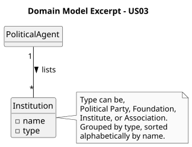

# US03 - List Organizations

## 2. Analysis

### 2.1. Relevant Domain Model Excerpt

To fulfill this requirement, the core concept involved is `Organization`, which is the same entity registered by the Administrator in US04.

A `PoliticalAgent` interacts with the system by requesting the full list of registered organizations. The system retrieves all `Organization` objects and presents them grouped by type and sorted alphabetically by name within each group.

The key entities and their attributes are:

* **Organization:**
    * **name:** The designation of the organization, used for alphabetical ordering within its group.
    * **type:** The legal form of the organization, represented as the `OrganizationType` enum with values `company`, `politicalParty`, `foundation`, `institute`, and `association`. Used for grouping.

* **PoliticalAgent:** The authenticated actor who triggers the listing operation.

Business rules:
* Organizations must be grouped by their `OrganizationType` before being displayed.
* Within each type group, organizations must be ordered alphabetically by name.
* Only organizations already registered in the system are shown.

### 2.2. Other Remarks

* This US does not introduce any new domain concepts; it relies entirely on the `Organization` entity defined in US04.
* The listing is a read-only operation. No data is created, modified, or deleted.
* The grouping and sorting logic must be applied at the system level before presenting the results to the Political Agent.
* Organizations serve as a reference for Political Agents when submitting Declarations of Interests (e.g., to associate professional positions, subsidy entries, or business participations with a registered organization).
