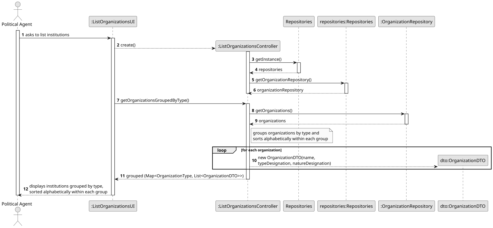
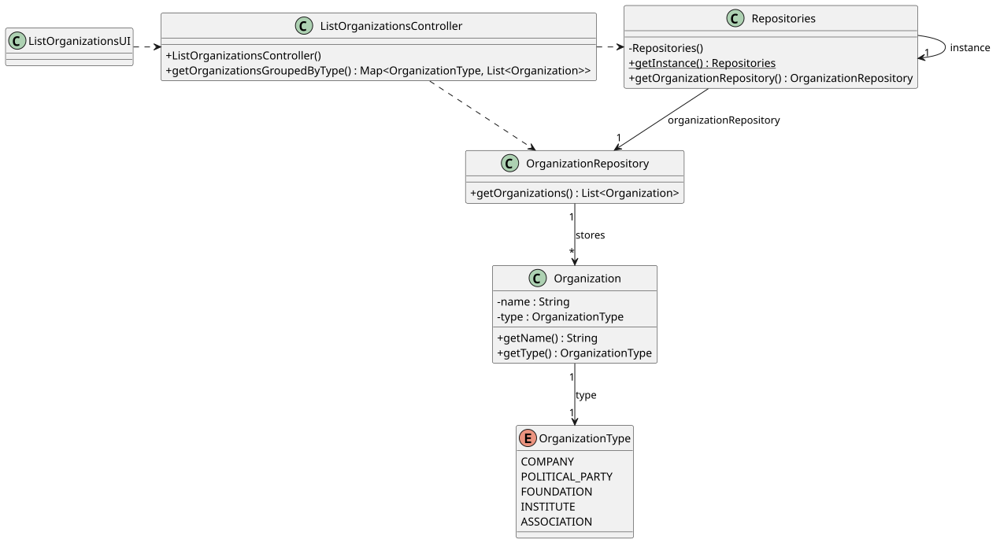

# US03 - List Institutions

## 3. Design

### 3.1. Rationale

**The rationale grounds on the SSD interactions and the identified input/output data.**

| Interaction ID | Question: Which class is responsible for...                                        | Answer                         | Justification (with patterns)                                                                                                                               |
|:---------------|:-----------------------------------------------------------------------------------|:-------------------------------|:------------------------------------------------------------------------------------------------------------------------------------------------------------|
| Step 1         | ...interacting with the actor?                                                     | ListOrganizationsUI            | **Pure Fabrication**: the UI has no business responsibilities; it only handles I/O with the Political Agent.                                                |
| Step 1         | ...coordinating the US?                                                            | ListOrganizationsController    | **Controller**: decouples the UI from the domain and orchestrates the use case.                                                                             |
| Step 2         | ...knowing all registered organizations?                                           | OrganizationRepository         | **Information Expert**: the repository holds all Organization instances.                                                                                    |
| Step 2         | ...grouping organizations by type?                                                 | ListOrganizationsController    | **Information Expert / Pure Fabrication**: the controller owns the grouping and sorting logic, keeping domain classes free of presentation concerns.         |
| Step 2         | ...sorting organizations alphabetically within each group?                         | ListOrganizationsController    | Uses a `Comparator` with `compareToIgnoreCase`, consistent with the Comparable/Comparator pattern taught in PPROG.                                          |
| Step 3         | ...carrying organization data to the UI?                                           | OrganizationDTO                | **DTO / Low Coupling**: the controller converts each Organization into a DTO, so the UI never depends on the domain entity and only receives display data.   |
| Step 3         | ...displaying the grouped result to the actor?                                     | ListOrganizationsUI            | **Information Expert**: the UI is responsible for user interactions and feedback.                                                                           |

### Systematization

According to the taken rationale, the conceptual classes promoted to software classes are:

* Organization

Other software classes (i.e. Pure Fabrication) identified:

* ListOrganizationsUI
* ListOrganizationsController
* OrganizationRepository
* OrganizationDTO

## 3.2. Sequence Diagram (SD)

## 3.3. Class Diagram (CD)

