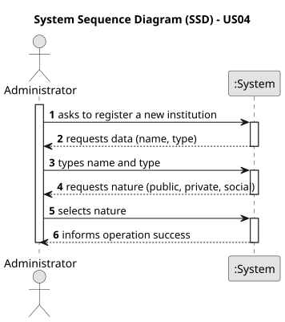

# US04 - Register an Organization

## 1. Requirements Engineering

### 1.1. User Story Description

As an Administrator, I want to register an Organization of a given type.

### 1.2. Customer Specifications and Clarifications

**From the specifications document:**

> Organizations represent entities (companies, political parties, foundations, institutes, or associations) that may be associated with a political agent's positions, business participations, or subsidy declarations.

> The institution type must be selected from a predefined list of available types.

**From the client clarifications:**

> **Question:** What are the valid organization types?
>
> **Answer:** The organization type must be selected from a predefined list: Company, Political Party, Foundation, Institute, or Association.

> **Question:** Can two organizations have the same name?
>
> **Answer:** No. The system must not allow the registration of duplicate organizations (same name and same type).

### 1.3. Acceptance Criteria

* **AC1:** An organization must have a valid name (cannot be null or empty).
* **AC2:** The organization type must be selected from the predefined list: Company, Political Party, Foundation, Institute, or Association.
* **AC3:** The system must not allow the registration of duplicate organizations (same name and same type).

### 1.4. Found out Dependencies

* There are no strict functional dependencies for this US. It is a foundational setup task for the domain model.

### 1.5. Input and Output Data

**Input Data:**

* Typed data:
    * name

* Selected data:
    * organization type (from predefined list: Company, Political Party, Foundation, Institute, Association)

**Output Data:**

* (In)Success of the operation

### 1.6. System Sequence Diagram (SSD)

### 1.7. Other Relevant Remarks

* Organizations registered through this US will be referenced by Political Agents when submitting Declarations of Interests (see US06), specifically in position entries, subsidy entries, and business participations.
* This US is closely related to **US03**, which allows Political Agents to list all registered organizations grouped by type.
