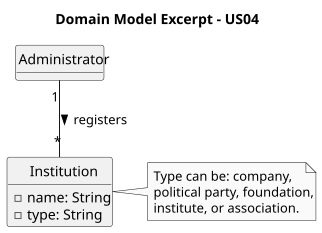

# US04 - Register an Institution

## 2. Analysis

### 2.1. Relevant Domain Model Excerpt

To fulfill this requirement, the core concept added to the domain model is the `Institution`.
The Administrator is the actor responsible for creating these institutions within the platform.

According to the business rules, an `Institution` is a broad term that can represent various types of organisations (like a company, a political party, a foundation, an institute, or an association). Therefore, the entity must capture the following attributes:
* **Name:** A unique identifier for the institution.
* **Type:** The legal form of the organisation (e.g., company, political party, foundation), represented as a separate `InstitutionType` entity with a `designation`.
* **Nature:** Whether the institution is public, private, or social, represented by the `InstitutionNature` enum.

The system relies on object serialization to persist the registered institutions, allowing them to be referenced later by Political Agents when submitting their declarations.

### 2.2. Other Remarks
