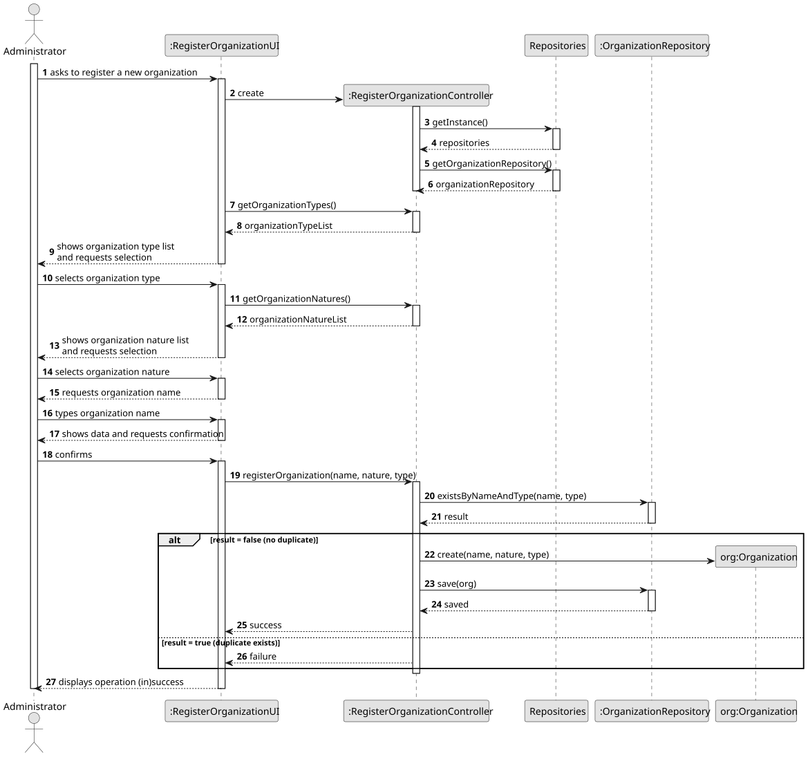
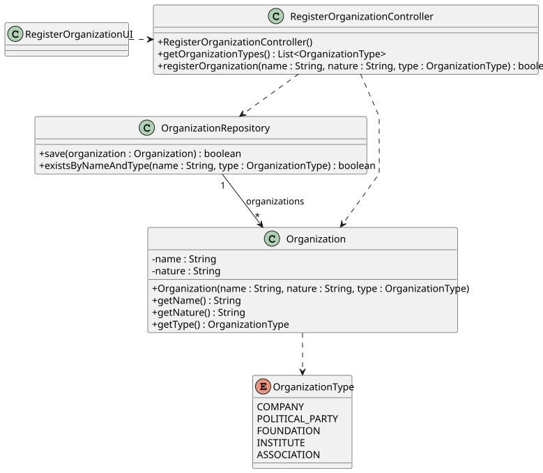

# US04 - Register an Organization

## 3. Design

### 3.1. Rationale

**The rationale grounds on the SSD interactions and the identified input/output data.**

| Interaction ID | Question: Which class is responsible for...                                                       | Answer                          | Justification (with patterns)                                                                                                                    |
|:---------------|:--------------------------------------------------------------------------------------------------|:--------------------------------|:-------------------------------------------------------------------------------------------------------------------------------------------------|
| Step 1         | ...interacting with the actor?                                                                    | RegisterOrganizationUI          | **Pure Fabrication**: the UI has no business responsibilities; it only handles I/O with the Administrator.                                       |
| Step 1         | ...coordinating the US?                                                                           | RegisterOrganizationController  | **Controller**: decouples the UI from the domain and orchestrates the use case.                                                                  |
| Step 2         | ...providing the list of available organization types for the Administrator to select from? (AC2) | OrganizationType                | **Information Expert**: the enum owns its own set of values.                                                                                     |
| Step 3         | ...saving the selected organization type?                                                         | RegisterOrganizationUI          | **Information Expert**: the UI is responsible for keeping user selections until submission.                                                      |
| Step 4         | ...requesting the organization name and nature?                                                   | RegisterOrganizationUI          | **Information Expert**: the UI is responsible for user interactions.                                                                             |
| Step 5         | ...saving the inputted name and nature?                                                           | RegisterOrganizationUI          | **Information Expert**: the UI is responsible for keeping inputted data until submission.                                                        |
| Step 6         | ...showing all data and requesting confirmation?                                                  | RegisterOrganizationUI          | **Information Expert**: the UI is responsible for user interactions.                                                                             |
| Step 7         | ...instantiating a new Organization?                                                              | RegisterOrganizationController  | **Creator** + **Controller**: the controller orchestrates construction and delegates persistence.                                                 |
| Step 7         | ...validating all data (local validation)?                                                        | Organization                    | **Information Expert**: an Organization owns its own data and is responsible for its own consistency.                                            |
| Step 7         | ...validating all data (global validation)?                                                       | OrganizationRepository          | **Information Expert**: the repository holds all Organization instances and is the natural place to check for duplicates.                        |
| Step 7         | ...persisting the new Organization?                                                               | OrganizationRepository          | **Pure Fabrication** + **Information Expert**: the repository is responsible for storing and retrieving all Organization instances.               |
| Step 8         | ...informing operation (in)success?                                                               | RegisterOrganizationUI          | **Information Expert**: the UI is responsible for user interactions.                                                                             |

### Systematization

According to the taken rationale, the conceptual classes promoted to software classes are:

* Organization
* OrganizationType

Other software classes (i.e. Pure Fabrication) identified:

* RegisterOrganizationUI
* RegisterOrganizationController
* OrganizationRepository

## 3.2. Sequence Diagram (SD)

_In this section, it is suggested to present an UML dynamic view representing the sequence of interactions between software objects that allows to fulfill the requirements._

## 3.3. Class Diagram (CD)

_In this section, it is suggested to present an UML static view representing the main related software classes that are involved in fulfilling the requirements as well as their relations, attributes and methods._

