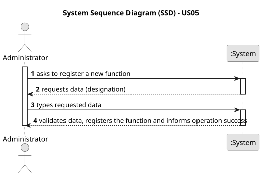

# US05 - Register Functions

## 1. Requirements Engineering

### 1.1. User Story Description

As an Administrator, I want to register Functions.

### 1.2. Customer Specifications and Clarifications

**From the specifications document:**
* "As an Administrator, I want to register Functions;"
* The system must allow the Administrator to create new political or administrative functions (e.g., Mayor, Minister, Deputy) that will later be used by Political Agents.
* The system must ensure data persistence through object serialization.

### 1.3. Acceptance Criteria

* **AC 1:** A function must have a valid designation (cannot be null or empty).
* **AC 2:** The system must not allow the registration of duplicate functions (i.e., functions with the exact same designation).

### 1.4. Found out Dependencies

* There are no functional dependencies for this US. It is a foundational setup task.

### 1.5 Input and Output Data

**Input Data:**
* Typed data:
    * Designation (String)

**Output Data:**
* (In)Success of the operation
* 
### 1.6. System Sequence Diagram (SSD)

### 1.7. Other Relevant Remarks

* A `Function` represents a hierarchical or administrative role within an institution (e.g., CEO, Director, Board Member). It must not be confused with `PoliticalFunction`, which represents the political mandate of a Political Agent (e.g., Minister, Deputy, Mayor).
* Functions registered through this US will later be referenced by Political Agents when submitting Declarations of Interests (see US06), specifically when declaring position entries held at institutions.