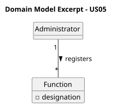

# US05 - Register Functions

## 2. Analysis

### 2.1. Relevant Domain Model Excerpt

To fulfill this requirement, the core concept added to the domain model is the `Function`.
The Administrator is the actor responsible for creating these functions, which represent the political or administrative roles (e.g., Mayor, Minister, Deputy) within the system.

The `Function` entity must contain a single primary attribute:
* **Designation:** A unique string identifying the role.

Business rules dictate that the system cannot have duplicated functions, meaning the designation acts as a unique identifier within the repository.

### 2.2. Other Remarks

* No specific technical difficulties are anticipated for this US in terms of analysis. It represents a straightforward creation of a domain entity.
* The persistence of these created objects must be ensured through object serialization, meaning the system's storage layer must be capable of serializing the `Function` class.