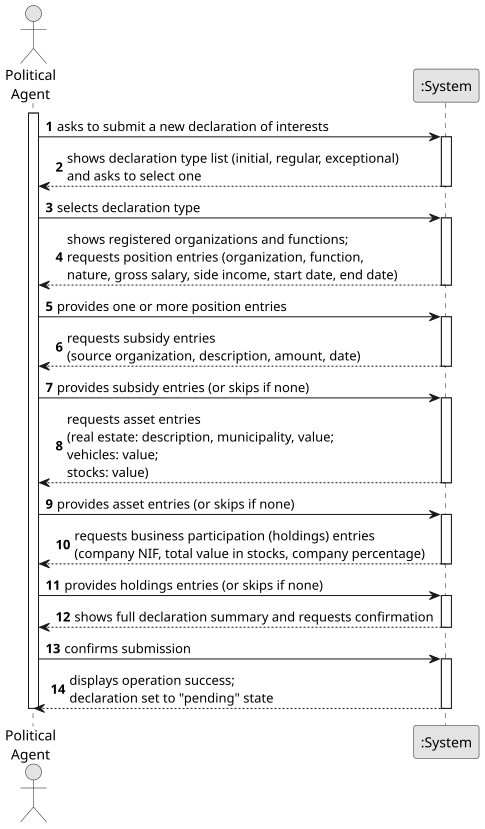

# US06 - Submit a Declaration of Interests

## 1. Requirements Engineering

### 1.1. User Story Description

As a Political Agent, I want to submit a declaration of interests including income, position/job/post (public, private, or social), assets, and business participations.

### 1.2. Customer Specifications and Clarifications

**From the specifications document:**

> Declarations of Interest may be initial, submitted by political agents whenever they begin a term of office; regular, submitted regularly (annually) while performing a political function; and exceptional, submitted whenever there is a significant change in the values mentioned in the declaration, when requested by the ethics committee, or for the purpose of correcting errors/omissions in previously submitted declarations.

> Declarations of interest must be structured in sections and items that include information regarding:
> - professional positions, public, private, and social positions held (or previously held), in which institutions, the nature of these institutions, the functions performed, and the payment received;
> - support and subsidies received, from which institutions and the nature of the institution;
> - assets (real estate: urban and rural) with their estimated value;
> - quotas, shares, and holdings in companies, with their respective market values.

> The declaration dataset is structured as follows (one row per declaration): `declaration id`, `agent id`, `role` ∈ {MP, Minister, Judge, State Secretary, Advisor}, `institution` ∈ {Parliament, Government, Courts}, `declaration type` ∈ {Initial, Regular, Exceptional}, `declaration date`, `gross salary` (annual, numeric), `side income` (numeric, can be zero), `assets in real estate` (numeric, can be zero), `assets in vehicles` (numeric, can be zero), `assets in stocks` (numeric, can be zero).

> The holdings dataset is structured as follows (one row per agent/company pair): `agent id`, `company NIF`, `total value in stocks`, `company percentage`, `declaration date`.

**From the client clarifications:**

> **Question:** What types of declaration can be submitted?
>
> **Answer:** A declaration can be of three types: initial (when beginning a term of office), regular (submitted annually), or exceptional (when significant changes occur or when requested by the ethics committee).

> **Question:** Can a Political Agent have more than one active declaration at the same time?
>
> **Answer:** No. Only one declaration per political agent per term/period is active at any given time. Exceptional declarations amend the current one.

> **Question:** How is income structured within a declaration?
>
> **Answer:** Income is split into two distinct fields: gross salary (annual gross salary reported) and side income (additional earnings, which can be zero).

> **Question:** How are assets structured within a declaration?
>
> **Answer:** Assets are declared across three separate categories: assets in real estate, assets in vehicles, and assets in stocks. Each category can be zero.

### 1.3. Acceptance Criteria

* **AC1:** All required fields must be filled in before submission.
* **AC2:** The declaration type must be selected from the predefined list: initial, regular, or exceptional.
* **AC3:** At least one position entry must be included in the declaration.
* **AC4:** Gross salary, side income, and all asset category values (real estate, vehicles, stocks) must be non-negative numeric values.
* **AC5:** The declaration must be associated with the authenticated Political Agent and the submission date is recorded automatically by the system at the moment of submission.
* **AC6:** Upon successful submission, the declaration is placed in a `pending` state and is not yet publicly visible.

### 1.4. Found out Dependencies

* There is a dependency on **US01 - Request Registration** and **US02 - Accept/Reject Registration**, as the Political Agent must be registered and authenticated in the platform before submitting a declaration.
* There is a dependency on **US04 - Register an Organization** and **US05 - Register Functions**, as organizations and functions must exist in the system to be referenced in the declaration.

### 1.5. Input and Output Data

**Input Data:**

* Typed data:
    * gross salary per position entry
    * side income per position entry (can be zero)
    * start date and end date per position entry
    * support and subsidy amounts, descriptions, and dates
    * assets in real estate value, description, and municipality per real estate entry (can be zero)
    * assets in vehicles value per vehicle entry (can be zero)
    * assets in stocks value per stock entry (can be zero)
    * business participation company NIF, total value in stocks, and company percentage per holding
    * attachment file(s) (optional)

* Selected data:
    * declaration type (initial, regular, or exceptional)
    * organization(s) and function(s) per position entry
    * nature of each position (public, private, or social)
    * organization source per subsidy entry
    * asset type (real estate / vehicles / stocks) per asset entry

**Output Data:**

* List of available declaration types
* List of registered organizations
* List of registered functions
* Summary of the submitted declaration
* (In)Success of the operation

### 1.6. System Sequence Diagram (SSD)

**_Other alternatives might exist._**

### 1.7. Other Relevant Remarks

* The submitted declaration is set to a `pending` state immediately after submission and remains invisible to the general public until validated by the Ethics Committee (see US08).
* The system must record the submission date for audit and temporal analysis purposes (used by US10, US11, US13–US18).
* Once validated, the data stored in declarations feeds the statistical analysis tools (US13–US18) and must be exportable to the declaration dataset (US24) and holdings dataset (US25) formats.
