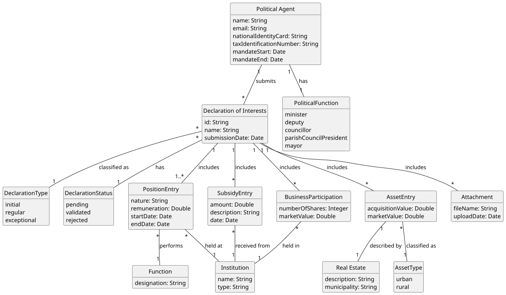

# US06 - Submit a Declaration of Interests

## 2. Analysis

### 2.1. Relevant Domain Model Excerpt

### 2.2. Other Remarks

* The `DeclarationOfInterests` is the central aggregate for this US. It groups all sections that a Political Agent must fill in upon submission.
* A declaration always belongs to exactly one `PoliticalAgent` and the submission date is automatically recorded by the system at the moment of submission.
* The declaration type (initial, regular, or exceptional) is represented as the `DeclarationType` enum, consistent with the global domain model.
* The declaration status is represented as the `DeclarationStatus` enum with values `pending`, `validated`, and `rejected`. Upon submission, the status is always set to `pending`.
* Each declaration is composed of zero or more entries per section (`PositionEntry`, `SubsidyEntry`, `AssetEntry`, `BusinessParticipation`). At least one `PositionEntry` is mandatory (AC3).
* `PositionEntry` holds `grossSalary: Double` (annual gross salary) and `sideIncome: Double` (additional earnings, can be zero), replacing the previous single `remuneration` field, in line with the declaration dataset structure (Table 2). It also holds `startDate: Date` and `endDate: Date`, and references a pre-existing `Function` and `Organization`. The nature of the position (public, private, social) is an attribute of `PositionEntry`.
* `AssetEntry` now covers three distinct asset categories, each with its own value: real estate (`RealEstate` with `description: String` and `municipality: String`), vehicles (`VehicleAsset` with `description: String`), and stocks (`StockAsset` with `description: String`). Each category value can be zero. The `assetValue: Double` is held on `AssetEntry` and the `AssetType` enum (`realEstate`, `vehicles`, `stocks`) classifies which category it belongs to.
* `BusinessParticipation` now holds `companyNIF: Long`, `totalValueInStocks: Double`, and `companyPercentage: Double`, matching the holdings dataset structure (Table 3). It references the company as an `Organization`.
* `SubsidyEntry` holds `amount: Double`, `description: String`, and `date: Date`, and references the source as an `Organization`.
* `Organization` and `Function` are pre-existing entities registered in the system (dependencies on US04 and US05). The type of organization is represented by the `OrganizationType` enum with values `company`, `politicalParty`, `foundation`, `institute`, and `association`, consistent with US03 and US04.
* A `DeclarationOfInterests` may include zero or more `Attachment` entries. Each attachment holds a `fileName: String` and `uploadDate: Date`, allowing supporting documents to be submitted alongside the declaration.
* Once validated, the declaration data is consumed by the statistical analysis tools (US13–US18) and must be exportable via US24 (declaration dataset) and US25 (holdings dataset).
