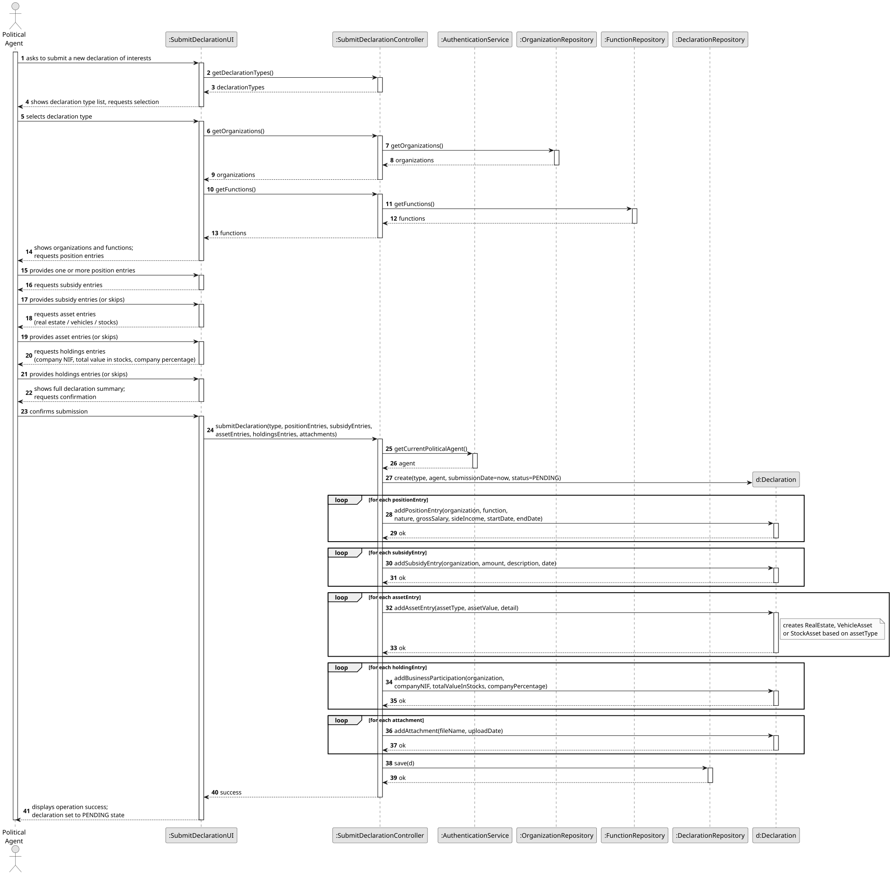
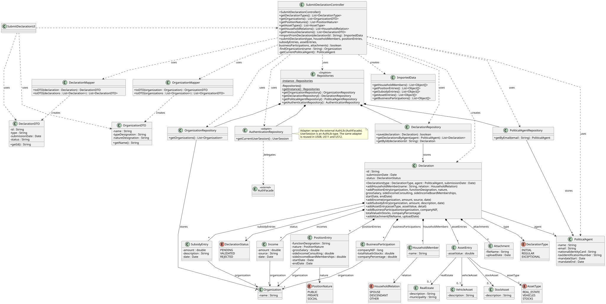

# US06 - Submit a Declaration of Interests

## 3. Design

### 3.1. Rationale

**The rationale grounds on the SSD interactions and the identified input/output data.**

| Interaction ID | Question: Which class is responsible for...                                                                                         | Answer                          | Justification (with patterns)                                                                                                                                                      |
|:---------------|:------------------------------------------------------------------------------------------------------------------------------------|:--------------------------------|:-----------------------------------------------------------------------------------------------------------------------------------------------------------------------------------|
| Step 1         | ...interacting with the actor?                                                                                                      | SubmitDeclarationUI             | **Pure Fabrication**: the UI has no business responsibilities; it only handles I/O with the Political Agent.                                                                       |
| Step 1         | ...coordinating the US?                                                                                                             | SubmitDeclarationController     | **Controller**: decouples the UI from the domain and orchestrates the use case.                                                                                                    |
| Step 1         | ...knowing the identity of the authenticated Political Agent? (AC5)                                                                 | AuthenticationRepository        | **Pure Fabrication**: the authentication repository (wrapping the AuthLib) owns user identity and role information; the controller queries it to associate the declaration with the correct agent. |
| Step 2         | ...providing the list of available declaration types so the agent can select one? (AC2)                                             | DeclarationType                 | **Information Expert**: the enum owns its own set of values.                                                                                                                       |
| Step 3         | ...providing the list of registered organizations so the agent can associate them with position entries?                            | OrganizationRepository          | **Pure Fabrication** + **Information Expert**: the repository holds all Organization instances and knows how to retrieve them.                                                      |
| Step 3         | ...creating each PositionEntry with its nature, grossSalary, sideIncomeConsulting, sideIncomeBoardMemberships, startDate, endDate, organization and function (entered as a free-text designation)? (AC3, AC4) | Declaration                     | **Creator** + **Information Expert**: a Declaration aggregates its PositionEntry instances; it is responsible for creating and owning them.                                        |
| Step 4         | ...creating each SubsidyEntry with its amount, description, date, and source organization?                                          | Declaration                     | **Creator**: a Declaration aggregates its SubsidyEntry instances.                                                                                                                  |
| Step 5         | ...creating each AssetEntry with its assetValue, type, and associated detail object (RealEstate, VehicleAsset, or StockAsset)? (AC4)| Declaration                     | **Creator**: a Declaration aggregates its AssetEntry instances.                                                                                                                    |
| Step 5         | ...knowing which asset detail class to instantiate based on the selected AssetType?                                                 | AssetEntry                      | **Information Expert**: an AssetEntry owns its AssetType and is responsible for creating the appropriate detail object (RealEstate, VehicleAsset, or StockAsset).                  |
| Step 6         | ...creating each BusinessParticipation with its companyNIF, totalValueInStocks, companyPercentage, and organization? (AC4)          | Declaration                     | **Creator**: a Declaration aggregates its BusinessParticipation instances.                                                                                                         |
| Step 7         | ...creating each Attachment with its fileName and uploadDate?                                                                       | Declaration                     | **Creator**: a Declaration aggregates its Attachment instances.                                                                                                                    |
| Step 8         | ...instantiating the Declaration with the selected type, associating it with the Political Agent, and setting the submissionDate and status to PENDING? (AC1, AC5, AC6) | SubmitDeclarationController     | **Controller** + **Creator**: the controller orchestrates construction and delegates persistence; it sets submissionDate (now) and status (PENDING) before saving.                  |
| Step 8         | ...persisting the newly created Declaration?                                                                                        | DeclarationRepository           | **Pure Fabrication** + **Information Expert**: the repository is responsible for storing and retrieving all Declaration instances.                                                  |
| Step 9         | ...presenting the operation result (success/failure) to the actor?                                                                  | SubmitDeclarationUI             | **Pure Fabrication**: presentation responsibility.                                                                                                                                 |

### Systematization

According to the taken rationale, the conceptual classes promoted to software classes are:

* PoliticalAgent
* Declaration
* DeclarationType
* DeclarationStatus
* PositionEntry
* SubsidyEntry
* AssetEntry
* AssetType
* RealEstate
* VehicleAsset
* StockAsset
* BusinessParticipation
* Organization
* Function
* Attachment

Other software classes (i.e. Pure Fabrication) identified:

* SubmitDeclarationUI
* SubmitDeclarationController
* AuthenticationRepository
* OrganizationRepository
* DeclarationRepository

## 3.2. Sequence Diagram (SD)

_In this section, it is suggested to present an UML dynamic view representing the sequence of interactions between software objects that allows to fulfill the requirements._

## 3.3. Class Diagram (CD)

_In this section, it is suggested to present an UML static view representing the main related software classes that are involved in fulfilling the requirements as well as their relations, attributes and methods._

