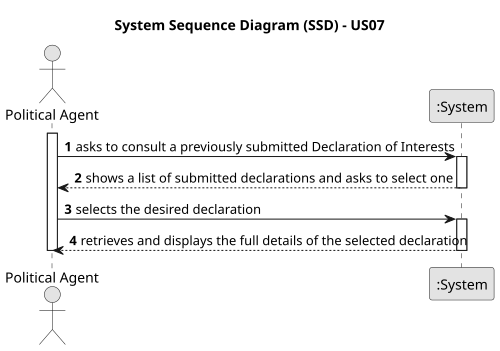

# US07 - Consult a previously submitted Declaration of Interests

## 1. Requirements Engineering

### 1.1. User Story Description

As a Political Agent, I want to consult a previously submitted Declaration of Interests.

### 1.2. Customer Specifications and Clarifications

**From the specifications document:**
* "As a Political Agent, I want to consult a previously submitted Declaration of Interests."
* Declarations of interest include information regarding: professional positions, support and subsidies received, assets (real estate), and quotas, shares, and holdings in companies.

### 1.3. Acceptance Criteria

* **AC 1:** The system must only allow a Political Agent to consult their own declarations of interests.
* **AC 2:** The system must present all the information associated with the selected declaration (income, positions, assets, and business participations) in a read-only format.

### 1.4. Found out Dependencies

* **US06:** "As a Political Agent, I want to submit a declaration of interests...". There is a strict functional dependency here. A Political Agent can only consult a declaration if at least one has been previously submitted.

### 1.5 Input and Output Data

**Input Data:**
* Selected data:
    * The specific declaration of interests to consult (from a provided list).

**Output Data:**
* List of previously submitted declarations (for selection).
* The detailed information of the selected Declaration of Interests.

### 1.6. System Sequence Diagram (SSD)

### 1.7. Other Relevant Remarks

* This US is a read-only operation. No data is created, modified, or deleted.
* The Political Agent can only view their own declarations; access to other agents' declarations is not permitted.
* The declaration details displayed must include all sections: position entries, subsidies, assets, business participations, and any attachments submitted alongside the declaration.
* This US is tightly coupled with **US06**, which defines the structure and content of a Declaration of Interests.