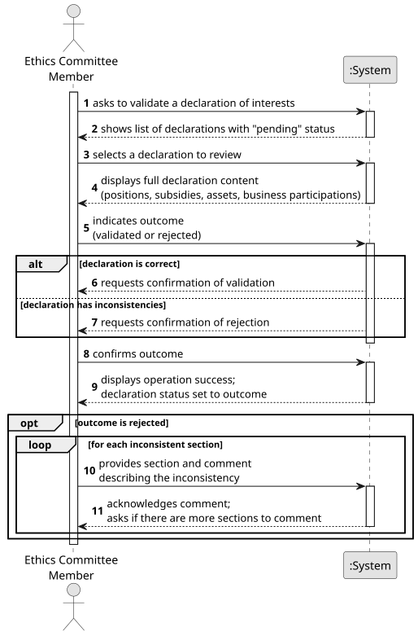

# US08 - Validate a Declaration of Interests

## 1. Requirements Engineering

### 1.1. User Story Description

As a member of the Ethics Committee, I want to validate a submitted Declaration of Interests.

### 1.2. Customer Specifications and Clarifications

**From the specifications document:**

> The Ethics Committee is normally responsible for: i) managing and supervising the Declarations of Interests of political actors; ii) verifying incompatibilities and impediments: situations where the professional or personal activity of a political actor may conflict with their mandate; iii) verifying the Code of Conduct: application and investigation of possible violations of the rules of conduct and civility.

> Declarations of Interest may be initial, regular, or exceptional.

**From the client clarifications:**

> **Question:** What happens when a declaration is validated?
>
> **Answer:** AC1: When correct, it is validated. AC2: When incorrect, the section/item with inconsistencies must be commented.

> **Question:** Can a member of the Ethics Committee partially validate a declaration?
>
> **Answer:** The declaration is treated as a whole. If inconsistencies are found in any section, the declaration is returned to the Political Agent with comments indicating the specific section(s) and item(s) that require correction.

### 1.3. Acceptance Criteria

* **AC1:** When the declaration is found to be correct and complete, the Ethics Committee member must mark it as **validated**; the declaration status transitions to `VALIDATED` and becomes visible according to role-based access rules.
* **AC2:** When the declaration contains inconsistencies or errors, the Ethics Committee member must add at least one comment, each identifying a specific **section** and describing the inconsistency found; multiple sections may be commented independently. The declaration status transitions to `REJECTED` and is returned to the Political Agent for correction.
* **AC3:** It must not be possible to validate or reject a declaration that is not in `PENDING` status.
* **AC4:** The identity of the Ethics Committee member performing the validation and the date of the action must be automatically recorded by the system.

### 1.4. Found out Dependencies

* There is a dependency on **US06 - Submit a Declaration of Interests**, as a declaration must have been submitted and be in `PENDING` status before it can be validated.
* There is a dependency on **US01 - Request Registration** and **US02 - Accept/Reject Registration**, as the Ethics Committee member must be registered and authenticated in the platform with the appropriate role.

### 1.5. Input and Output Data

**Input Data:**

* Selected data:
    * declaration to validate (from the list of pending declarations)
    * validation outcome (validated / rejected with comments)

* Typed data (only when rejecting, one or more times):
    * section containing the inconsistency
    * comment describing the nature of the inconsistency in that section

**Output Data:**

* List of declarations pending validation
* Full content of the selected declaration
* (In)Success of the operation
* Updated declaration status (`VALIDATED` or `REJECTED`)

### 1.6. System Sequence Diagram (SSD)

**_Other alternatives might exist._**

### 1.7. Other Relevant Remarks

* All validation actions (both approvals and rejections) are permanently recorded in a `ValidationRecord` for audit purposes, including the identity of the Ethics Committee member and the validation date.
* A rejected declaration is returned to the submitting Political Agent for correction; upon resubmission it re-enters `PENDING` status and can be validated again, generating a new independent `ValidationRecord`.
* Once validated, the declaration becomes accessible to citizens, journalists, and other authorised users subject to role-based data visibility rules (see US10 and US11).
