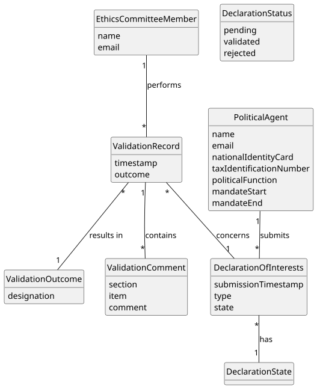

# US08 - Validate a Declaration of Interests

## 2. Analysis

### 2.1. Relevant Domain Model Excerpt

### 2.2. Other Remarks

* The `ValidationRecord` is the key concept introduced by this US. It captures the result of a single validation action performed by an `EthicsCommitteeMember` on a `DeclarationOfInterests`, and is permanently stored for audit purposes.
* A `DeclarationOfInterests` can only be acted upon when its `DeclarationStatus` is `PENDING` (AC3). The system must enforce this guard before proceeding.
* `DeclarationStatus` is an enum with values `PENDING`, `VALIDATED`, and `REJECTED`, consistent with the global domain model and US06.
* When validated, the declaration transitions to `VALIDATED` status and becomes accessible to other users according to role-based visibility rules (see US10, US11).
* When rejected, the declaration transitions to `REJECTED` status and is made available to the `PoliticalAgent` for amendment. The `ValidationRecord` in this case must contain at least one `ValidationComment`; the member may add as many comments as needed, one per inconsistent section, each identifying the section and describing the issue (AC2).
* `ValidationOutcome` is an enum with values `VALIDATED` and `RETURNED_FOR_CORRECTION`, consistent with the global domain model.
* Each validation action produces exactly one `ValidationRecord`, which records the `EthicsCommitteeMember` identity and the `validationDate: Date` automatically (AC4).
* The same `EthicsCommitteeMember` may validate the same declaration more than once (e.g., after resubmission), generating a new independent `ValidationRecord` each time.
