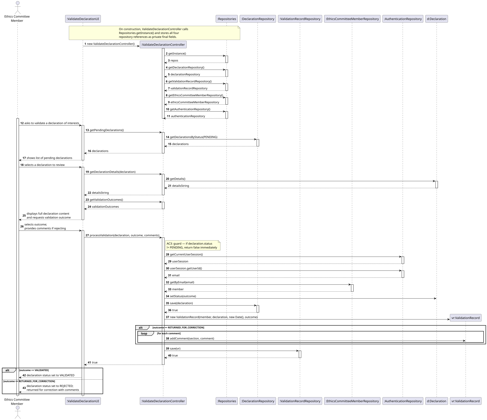
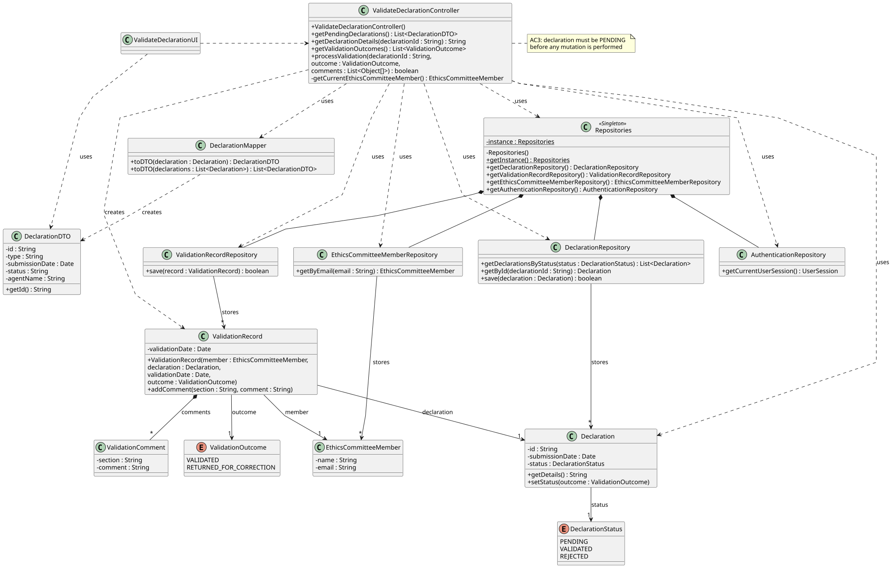

# US08 - Validate a Declaration of Interests

## 3. Design

### 3.1. Rationale

**The rationale grounds on the SSD interactions and the identified input/output data.**

| Interaction ID | Question: Which class is responsible for...                                                                                     | Answer                          | Justification (with patterns)                                                                                                                                                           |
|:---------------|:--------------------------------------------------------------------------------------------------------------------------------|:--------------------------------|:----------------------------------------------------------------------------------------------------------------------------------------------------------------------------------------|
| Step 1         | ...interacting with the actor?                                                                                                  | ValidateDeclarationUI           | **Pure Fabrication**: the UI has no business responsibilities; it only handles I/O with the Ethics Committee Member.                                                                    |
| Step 1         | ...coordinating the US?                                                                                                         | ValidateDeclarationController   | **Controller**: decouples the UI from the domain and orchestrates the use case.                                                                                                         |
| Step 1         | ...knowing the identity of the authenticated Ethics Committee Member? (AC4)                                                     | AuthenticationService           | **Pure Fabrication**: the auth service owns user identity and role information; the controller queries it to associate the ValidationRecord with the correct member.                     |
| Step 2         | ...obtaining the list of declarations with PENDING status? (AC3)                                                                | DeclarationRepository           | **Pure Fabrication** + **Information Expert**: the repository holds all Declaration instances and is the natural place to filter by status.                                              |
| Step 2         | ...knowing whether a declaration has PENDING status? (AC3)                                                                      | Declaration                     | **Information Expert**: a Declaration owns its `status`.                                                                                                                                |
| Step 3         | ...providing the full content of the selected declaration (positions, subsidies, assets, participations)?                       | Declaration                     | **Information Expert**: a Declaration aggregates all its entries (PositionEntry, SubsidyEntry, AssetEntry, BusinessParticipation) and owns its own data.                                |
| Step 4         | ...enforcing that only PENDING declarations can be acted upon? (AC3)                                                            | ValidateDeclarationController   | **Controller**: the PENDING-status guard is a use-case orchestration concern that must be checked before any state change is performed.                                                  |
| Step 4         | ...transitioning the declaration status to VALIDATED or REJECTED?                                                               | Declaration                     | **Information Expert**: a Declaration owns its `status` and is responsible for managing state transitions.                                                                              |
| Step 4         | ...creating the ValidationRecord with the member identity and validationDate? (AC4)                                             | ValidateDeclarationController   | **Creator** + **Controller**: the controller orchestrates the creation of the ValidationRecord, supplying the member (from AuthenticationService) and the current date.                  |
| Step 4         | ...creating one or more ValidationComment instances when the declaration is rejected? (AC2)                                     | ValidationRecord                | **Creator**: a ValidationRecord aggregates its ValidationComment instances and is responsible for creating and owning them.                                                              |
| Step 4         | ...persisting the ValidationRecord (and its comments)?                                                                          | ValidationRecordRepository      | **Pure Fabrication** + **Information Expert**: the repository is responsible for storing and retrieving all ValidationRecord instances.                                                  |
| Step 4         | ...persisting the updated declaration status?                                                                                   | DeclarationRepository           | **Pure Fabrication** + **Information Expert**: the repository is responsible for persisting Declaration state changes.                                                                   |
| Step 5         | ...presenting the operation result (success/failure) and updated status to the actor?                                           | ValidateDeclarationUI           | **Pure Fabrication**: presentation responsibility.                                                                                                                                      |

### Systematization

According to the taken rationale, the conceptual classes promoted to software classes are:

* Declaration
* DeclarationStatus
* ValidationRecord
* ValidationOutcome
* ValidationComment
* EthicsCommitteeMember

Other software classes (i.e. Pure Fabrication) identified:

* ValidateDeclarationUI
* ValidateDeclarationController
* AuthenticationService
* DeclarationRepository
* ValidationRecordRepository

## 3.2. Sequence Diagram (SD)

_In this section, it is suggested to present an UML dynamic view representing the sequence of interactions between software objects that allows to fulfill the requirements._

## 3.3. Class Diagram (CD)

_In this section, it is suggested to present an UML static view representing the main related software classes that are involved in fulfilling the requirements as well as their relations, attributes and methods._

