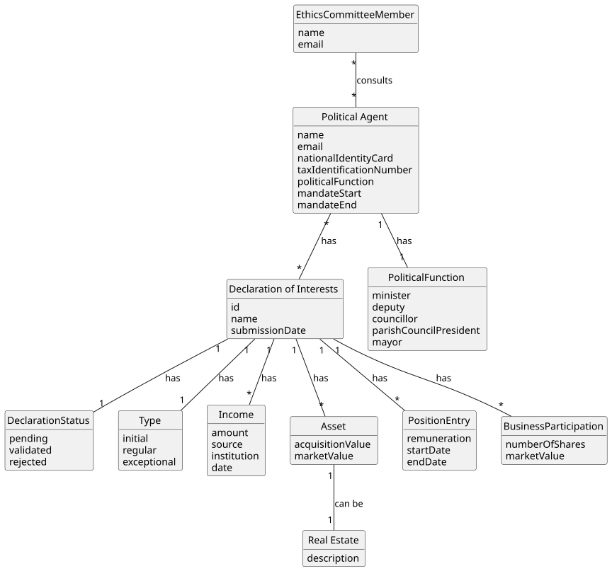

# US09 - Consult the Integrated Situation of a Political Agent on a Given Date

## 2. Analysis

### 2.1. Relevant Domain Model Excerpt

### 2.2. Other Remarks

The "integrated situation" of a political agent on a given date is composed of all information declared across their validated declarations submitted up to that date. This includes:

- The **position** held by the agent (recorded as an attribute of the Declaration of Interests)
- **Income** entries — including salary, side incomes (consulting, board memberships), support, and subsidies — with the respective amount, source, institution of origin, and date, to ensure transparency and allow detection of potential conflicts of interest
- **Assets** (identified by acquisition value and market value; assets may be further classified as Real Estate)
- The **type** of each declaration (`INITIAL`, `REGULAR`, or `EXCEPTIONAL`)

Each Declaration of Interests has a **status** (`PENDING`, `VALIDATED`, or `REJECTED`). Only declarations with status `VALIDATED` are taken into account (per AC2). If multiple declarations exist up to the given date, the most recent validated data per category should be presented. If no validated declarations exist, an appropriate message is shown to the user (AC3).

This US depends on US06 (declaration submission) and US08 (declaration validation) being implemented, as there must be validated declarations for this feature to return meaningful results.
