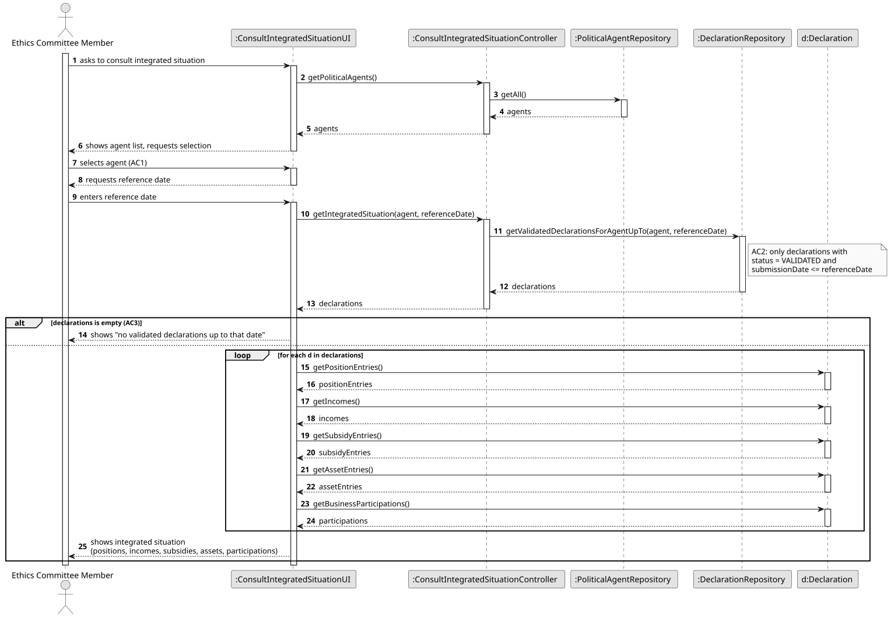
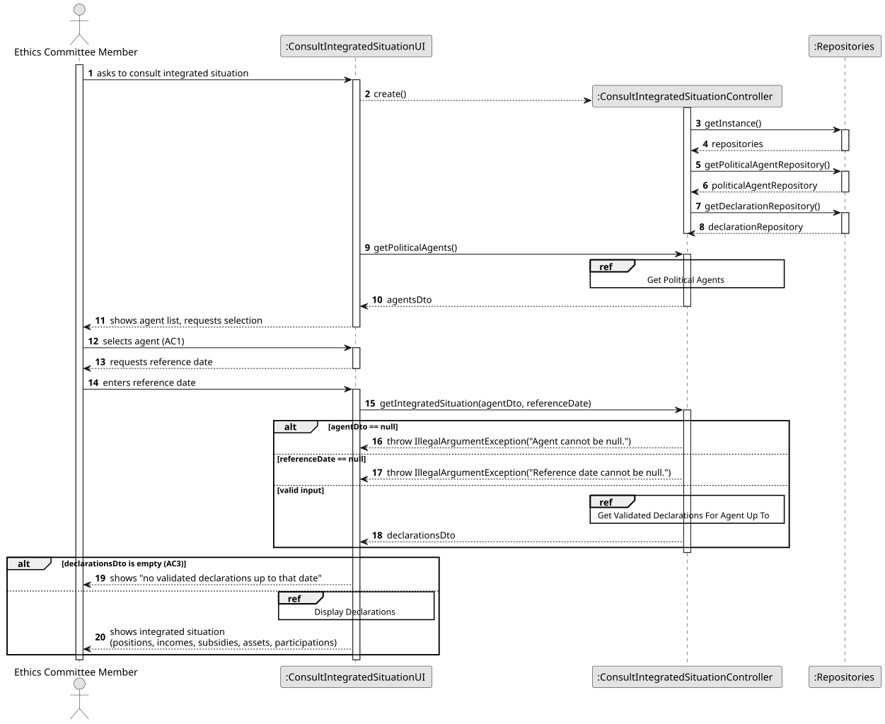
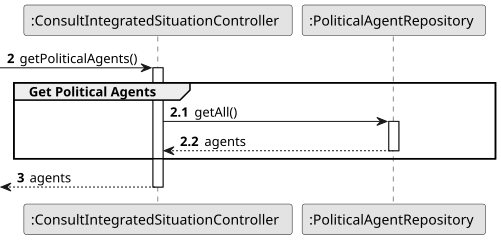
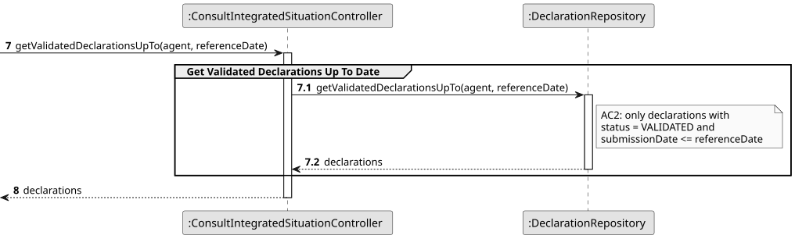
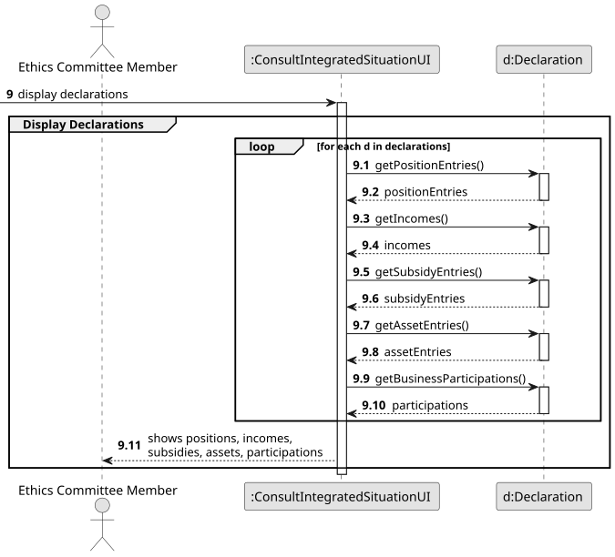
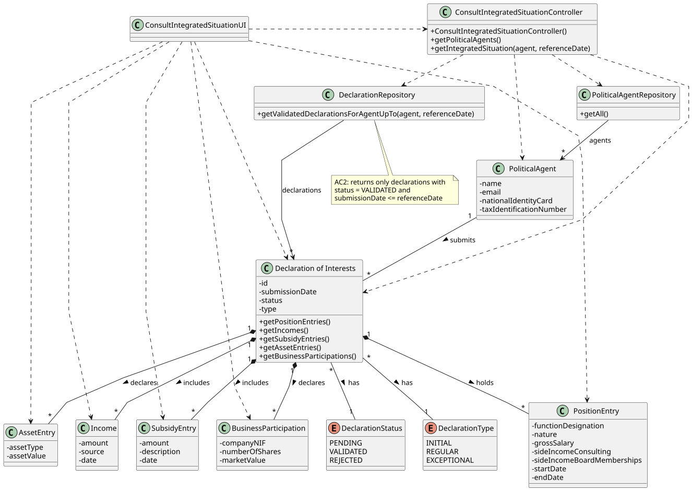

# US09 - Consult the Integrated Situation of a Political Agent on a Given Date

## 3. Design

### 3.1. Rationale

**The rationale grounds on the SSD interactions and the identified input/output data.**

| Interaction ID | Question: Which class is responsible for...                                                          | Answer                             | Justification (with patterns)                                                                                                                                      |
|:---------------|:-----------------------------------------------------------------------------------------------------|:-----------------------------------|:-------------------------------------------------------------------------------------------------------------------------------------------------------------------|
| Step 1         | ...interacting with the actor?                                                                       | ConsultIntegratedSituationUI       | **Pure Fabrication**: the UI has no business responsibilities; it only handles I/O with the Ethics Committee Member.                                               |
| Step 1         | ...coordinating the US?                                                                              | ConsultIntegratedSituationController | **Controller**: decouples the UI from the domain and orchestrates the use case.                                                                                  |
| Step 2         | ...obtaining the list of registered political agents so the actor can pick one?                      | PoliticalAgentRepository           | **Pure Fabrication** + **Information Expert**: the repository holds all `PoliticalAgent` instances and exposes them via `getAll()`.                                |
| Step 3         | ...obtaining the validated declarations of the selected agent up to the reference date?              | DeclarationRepository              | **Pure Fabrication** + **Information Expert**: the repository holds all `Declaration` instances and is the natural place to filter by agent, status and date via `getValidatedDeclarationsForAgentUpTo(agent, referenceDate)`. |
| Step 3         | ...knowing whether a declaration is VALIDATED and was submitted on/before the reference date?        | Declaration                        | **Information Expert**: a `Declaration` owns its `status` (`getStatus()`) and `submissionDate` (`getSubmissionDate()`).                                            |
| Step 3         | ...showing a message when there are no validated declarations? (AC3)                                 | ConsultIntegratedSituationUI       | **Pure Fabrication**: the empty-result feedback is a presentation concern.                                                                                         |
| Step 4         | ...producing the entries of each declaration (positions, incomes, subsidies, assets, participations)? | Declaration                        | **Information Expert**: a `Declaration` aggregates its `PositionEntry`, `Income`, `SubsidyEntry`, `AssetEntry` and `BusinessParticipation` collections, exposed via their respective getters. |
| Step 4         | ...presenting the details to the actor?                                                              | ConsultIntegratedSituationUI       | **Pure Fabrication**: presentation responsibility — iterates the declarations and prints each entry collection.                                                    |

### Systematization

According to the taken rationale, the conceptual classes promoted to software classes are:

* PoliticalAgent
* Declaration
* PositionEntry
* Income
* SubsidyEntry
* AssetEntry
* BusinessParticipation

Other software classes (i.e. Pure Fabrication) identified:

* ConsultIntegratedSituationUI
* ConsultIntegratedSituationController
* PoliticalAgentRepository
* DeclarationRepository

## 3.2. Sequence Diagram (SD)

The full sequence is split into smaller diagrams referenced from the main one for readability (Interaction Use pattern).

Full sequence:

Split (main) view with `ref` frames:

Partial diagrams referenced from the split view:

## 3.3. Class Diagram (CD)

