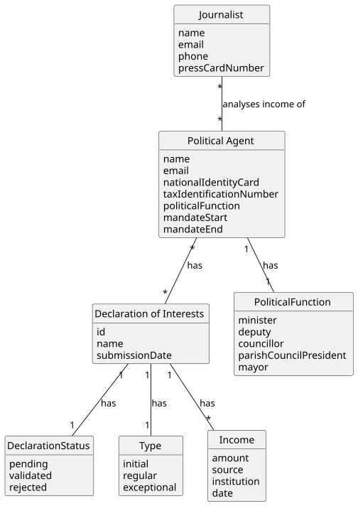

# US10 - Analyse the Evolution of a Political Agent's Income Over a Period

## 2. Analysis

### 2.1. Relevant Domain Model Excerpt

### 2.2. Other Remarks

The income evolution analysis covers all validated declarations of a given political agent submitted within a specified period (between a start date and an end date). For each declaration found, the following income data is shown:

- Each **Income** entry associated with the declaration — including salary, side incomes, support, and subsidies — with the respective amount, source, institution of origin, and date, allowing the journalist to trace where each income comes from and detect potential conflicts of interest
- The **type** of the declaration (initial, regular, or exceptional), which provides context for changes in income over time

Each Declaration of Interests has a **status** (pending, validated, or rejected). Only declarations with status `validated` are taken into account (per AC3). Results are displayed in chronological order by submission date (AC4), allowing the journalist to observe how income evolved across declarations. If no validated declarations exist within the specified period, an appropriate message is shown (AC5).

This US depends on US06 (declaration submission) and US08 (declaration validation) being implemented, as there must be validated declarations for this feature to return meaningful results.
