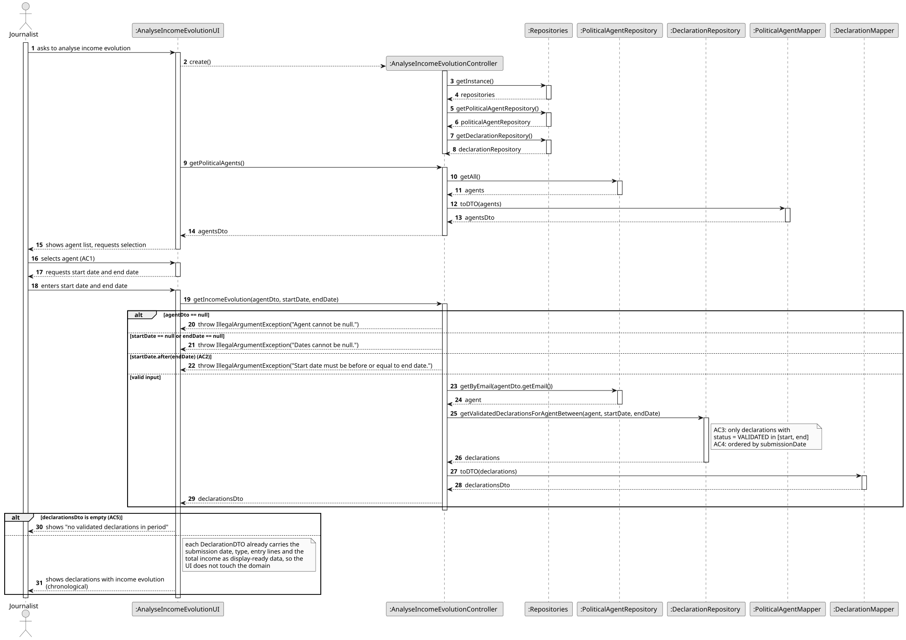
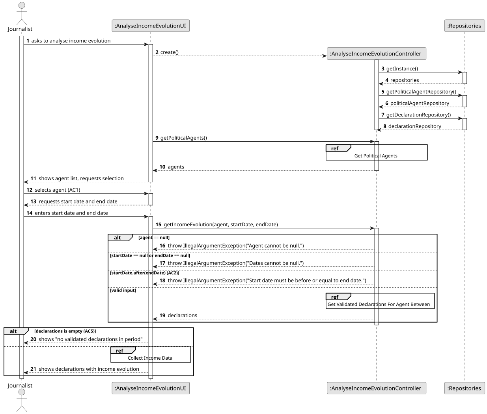
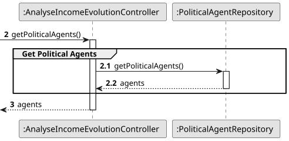
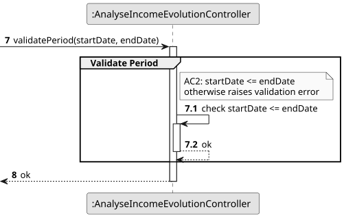
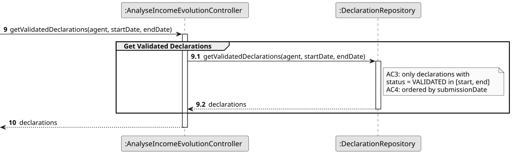
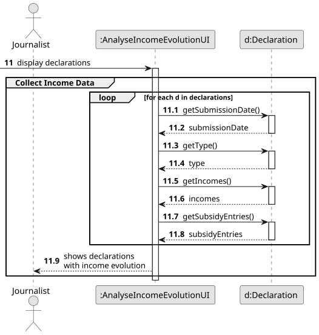
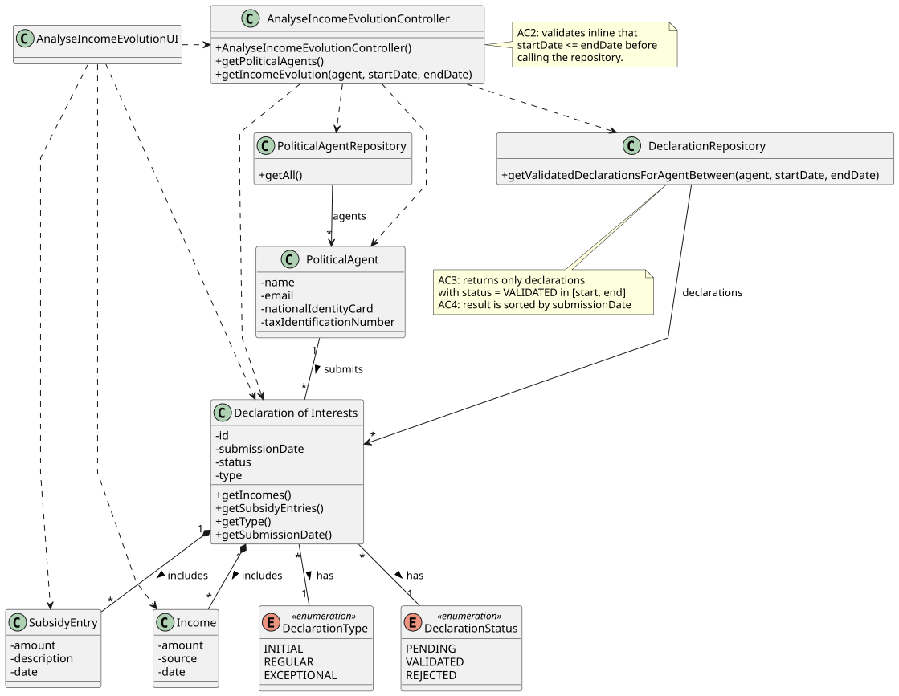

# US10 - Analyse the Evolution of a Political Agent's Income Over a Period

## 3. Design

### 3.1. Rationale

**The rationale grounds on the SSD interactions and the identified input/output data.**

| Interaction ID | Question: Which class is responsible for...                                                                  | Answer                            | Justification (with patterns)                                                                                                                                |
|:---------------|:-------------------------------------------------------------------------------------------------------------|:----------------------------------|:-------------------------------------------------------------------------------------------------------------------------------------------------------------|
| Step 1         | ...interacting with the actor?                                                                               | AnalyseIncomeEvolutionUI          | **Pure Fabrication**: the UI has no business responsibilities; it only handles I/O with the Journalist.                                                      |
| Step 1         | ...coordinating the US?                                                                                      | AnalyseIncomeEvolutionController  | **Controller**: decouples the UI from the domain and orchestrates the use case.                                                                              |
| Step 2         | ...obtaining the list of registered political agents so the journalist can pick one? (AC1)                   | PoliticalAgentRepository          | **Pure Fabrication** + **Information Expert**: the repository holds all PoliticalAgent instances and knows how to retrieve them.                             |
| Step 3         | ...validating that the start date is before or equal to the end date? (AC2)                                  | AnalyseIncomeEvolutionController  | **Controller**: input-period validation is a use case orchestration concern; it must happen before any repository query is performed.                        |
| Step 3         | ...obtaining the validated declarations of the selected agent within the period? (AC3)                       | DeclarationRepository             | **Pure Fabrication** + **Information Expert**: the repository holds all Declaration instances and is the natural place to filter by agent, status and dates. |
| Step 3         | ...knowing whether a declaration is VALIDATED and was submitted within the period?                           | Declaration                       | **Information Expert**: a Declaration owns its `status` and `submissionDate`.                                                                                |
| Step 3         | ...ordering the resulting declarations chronologically by submission date? (AC4)                             | DeclarationRepository             | **Information Expert**: the repository owns the collection and is responsible for returning it sorted; sorting belongs with the data source.                 |
| Step 3         | ...showing a message when there are no validated declarations in the period? (AC5)                           | AnalyseIncomeEvolutionUI          | **Pure Fabrication**: the empty-result feedback is a presentation concern.                                                                                   |
| Step 3         | ...producing the income data of each declaration (amount, source, institution, date) and the declaration type? | Declaration                       | **Information Expert**: a Declaration aggregates its Income entries and owns its `type`.                                                                     |
| Step 3         | ...exposing the amount, source, institution and date of a single income entry?                               | Income                            | **Information Expert**: an Income owns its own attributes.                                                                                                   |
| Step 3         | ...presenting the chronologically ordered list of declarations with the income evolution to the actor?       | AnalyseIncomeEvolutionUI          | **Pure Fabrication**: presentation responsibility.                                                                                                           |

### Systematization

According to the taken rationale, the conceptual classes promoted to software classes are:

* PoliticalAgent
* Declaration
* Income

Other software classes (i.e. Pure Fabrication) identified:

* AnalyseIncomeEvolutionUI
* AnalyseIncomeEvolutionController
* PoliticalAgentRepository
* DeclarationRepository

## 3.2. Sequence Diagram (SD)

### Full Diagram

This diagram shows the full sequence of interactions between the classes involved in the realization of this user story.

### Split Diagrams

The following diagram shows the same sequence of interactions between the classes involved in the realization of this user story, but it is split in partial diagrams to better illustrate the interactions between the classes.

It uses Interaction Occurrence (a.k.a. Interaction Use).

**Get Political Agents Partial SD**

**Validate Period Partial SD**

**Get Validated Declarations Partial SD**

**Collect Income Data Partial SD**

## 3.3. Class Diagram (CD)

_In this section, it is suggested to present an UML static view representing the main related software classes that are involved in fulfilling the requirements as well as their relations, attributes and methods._

