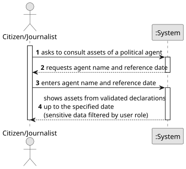

# US11 - Consult the Assets of a Political Agent on a Specific Date

## 1. Requirements Engineering

### 1.1. User Story Description

As a citizen/journalist, I want to consult the assets of a political agent on a specific date.

### 1.2. Customer Specifications and Clarifications

**From the specifications document:**
* The system should display the assets of a chosen political agent on a specific date, accessible for both citizens and journalists. Only validated declarations should be considered.

**From the client clarifications:**
* None yet.

### 1.3. Acceptance Criteria

* **AC 1:** The user must select a valid registered political agent.
* **AC 2:** Only validated declarations (status = VALIDATED) up to the specified date are considered.
* **AC 3:** If no validated declarations exist up to the specified date, an appropriate message is shown.
* **AC 4:** Sensitive data (acquisition value, market value) must be partially omitted for citizens. Journalists see full details.

### 1.4. Found out Dependencies

* **US06** - declarations must exist to be consulted.
* **US08** - only validated declarations are included.
* **US01/US02** - if the user is a journalist, they must be registered and approved to access this feature.

### 1.5 Input and Output Data

**Input Data:**
* Selectable data:
    * Political Agent name
* Typed/Selectable data:
    * Reference date

**Output Data:**
* List of assets from validated declarations up to the specified date (acquisition value, market value, real estate description), filtered by user role
* (In)Success of the operation

### 1.6. System Sequence Diagram (SSD)

