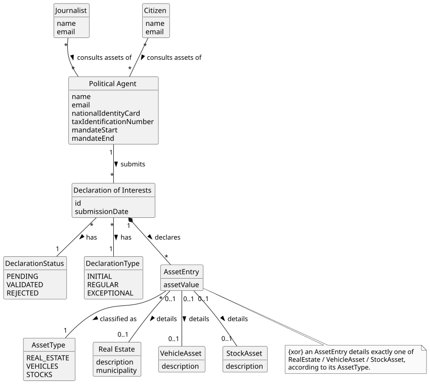

# US11 - Consult the Assets of a Political Agent on a Specific Date

## 2. Analysis

### 2.1. Relevant Domain Model Excerpt

### 2.2. Other Remarks

The asset consultation shows all assets declared by a given political agent in their validated declaration(s) up to a specific date. Each **Asset** is characterised by its acquisition value and market value. Assets may further be classified as **Real Estate** (with a description and municipality).

Access to this feature is available to both **Citizens** and **Journalists**, but the data shown differs based on the user's role (AC1):

- **Citizens** — sensitive financial data (acquisition value and market value) is partially hidden.
- **Journalists** — full asset details are displayed.

The **type** of the declaration (`INITIAL`, `REGULAR`, or `EXCEPTIONAL`) is also relevant as context for when the asset was declared. Each Declaration of Interests has a **status** (`PENDING`, `VALIDATED`, or `REJECTED`). Only declarations with status `VALIDATED` up to the specified date are considered (per AC2). If no validated declarations exist, an appropriate message is shown (AC3).

This US depends on US06 (declaration submission) and US08 (declaration validation) being implemented, as there must be validated declarations for this feature to return meaningful results.
