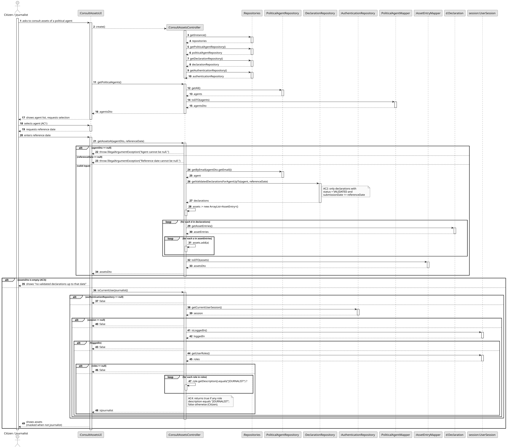
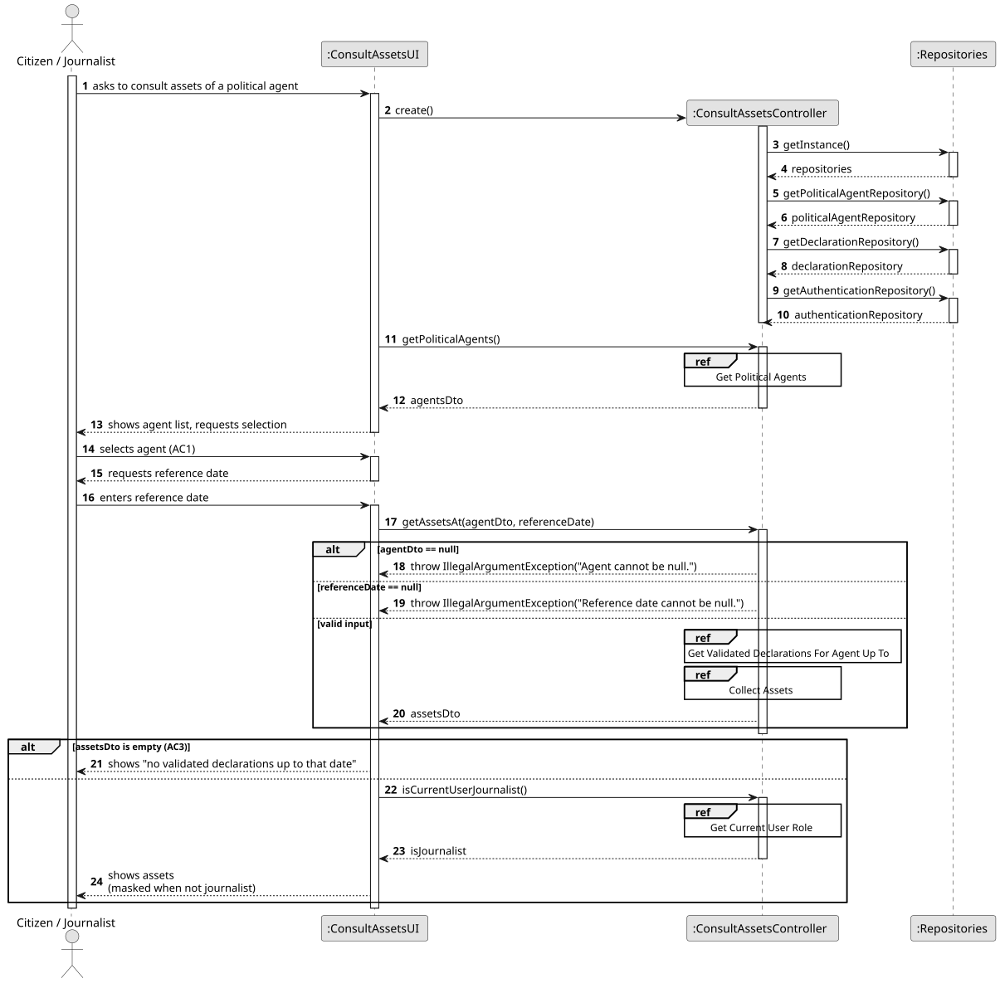
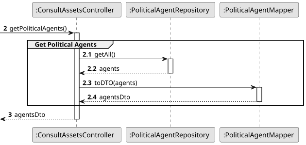
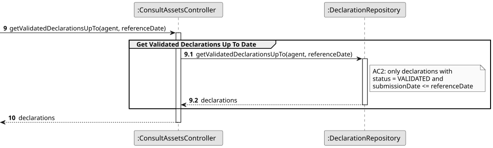
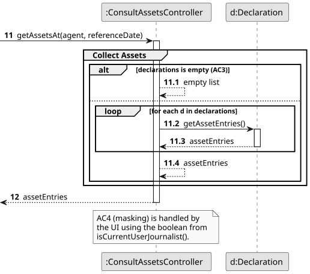
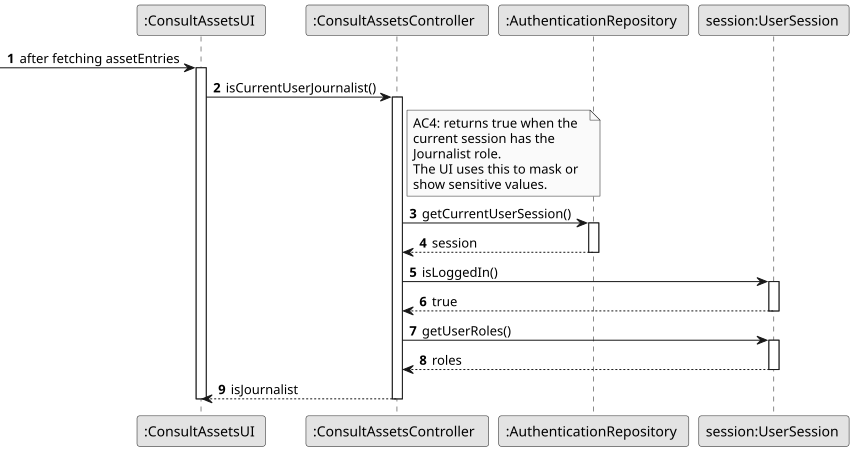

# US11 - Consult the Assets of a Political Agent on a Specific Date

## 3. Design

### 3.1. Rationale

| Interaction ID | Question: Which class is responsible for...                                                              | Answer                          | Justification (with patterns)                                                                                                                                |
|:---------------|:---------------------------------------------------------------------------------------------------------|:--------------------------------|:-------------------------------------------------------------------------------------------------------------------------------------------------------------|
| Step 1         | ...interacting with the actor?                                                                           | ConsultAssetsUI                 | **Pure Fabrication**: the UI handles I/O with the Citizen / Journalist.                                                                                      |
| Step 1         | ...coordinating the US?                                                                                  | ConsultAssetsController         | **Controller**: decouples the UI from the domain and orchestrates the use case.                                                                              |
| Step 1         | ...knowing the role of the authenticated user (Citizen vs Journalist)? (AC4)                             | AuthenticationRepository        | **Pure Fabrication**: the auth repository owns the current `UserSession` and its `UserRoleDTO` list. The controller queries it through `isCurrentUserJournalist()`. |
| Step 2         | ...obtaining the list of registered political agents so the actor can pick one? (AC1)                    | PoliticalAgentRepository        | **Pure Fabrication** + **Information Expert**: the repository holds all `PoliticalAgent` instances and exposes them via `getAll()`.                          |
| Step 3         | ...obtaining the validated declarations of the selected agent up to the reference date? (AC2)            | DeclarationRepository           | **Pure Fabrication** + **Information Expert**: `getValidatedDeclarationsForAgentUpTo(agent, referenceDate)` filters by agent + status + date.                |
| Step 3         | ...knowing whether a declaration is VALIDATED and was submitted on/before the reference date?            | Declaration                     | **Information Expert**: a `Declaration` owns its `status` and `submissionDate`.                                                                              |
| Step 3         | ...showing a message when there are no validated declarations up to the reference date? (AC3)            | ConsultAssetsUI                 | **Pure Fabrication**: the empty-result feedback is a presentation concern.                                                                                   |
| Step 3         | ...producing the full list of assets across the agent's validated declarations up to the reference date? | Declaration                     | **Information Expert**: a `Declaration` aggregates its `AssetEntry` instances and exposes them via `getAssetEntries()`.                                      |
| Step 3         | ...exposing the asset type, value and, when applicable, the real-estate, vehicle or stock detail?        | AssetEntry                      | **Information Expert**: an `AssetEntry` owns its `assetType`, `assetValue` and the optional `RealEstate` / `VehicleAsset` / `StockAsset` detail.             |
| Step 4         | ...deciding whether sensitive financial data should be masked? (AC4)                                     | ConsultAssetsController         | The controller exposes `isCurrentUserJournalist()`; the boolean drives the masking logic.                                                                    |
| Step 4         | ...applying the masking when presenting the asset list to the actor?                                     | ConsultAssetsUI                 | **Pure Fabrication**: the UI uses the boolean returned by the controller and prints either the full value or `***` accordingly.                              |
| Step 2/3       | ...transferring the agents and asset entries to the UI without exposing the domain objects? | PoliticalAgentMapper / AssetEntryMapper | **DTO** + **Low Coupling** + **Pure Fabrication**: the mappers convert the domain objects into `PoliticalAgentDTO` / `AssetEntryDTO`; the asset DTO flags sensitive details so the UI can mask them (AC4). |

### Systematization

According to the taken rationale, the conceptual classes promoted to software classes are:

* PoliticalAgent
* Declaration
* AssetEntry
* RealEstate
* VehicleAsset
* StockAsset

Other software classes (i.e. Pure Fabrication) identified:

* ConsultAssetsUI
* ConsultAssetsController
* PoliticalAgentRepository
* DeclarationRepository
* AuthenticationRepository

## 3.2. Sequence Diagram (SD)

### Full Diagram

This diagram shows the full sequence of interactions between the classes involved in the realization of this user story.

### Split Diagrams

The following diagram shows the same sequence of interactions between the classes involved in the realization of this user story, but it is split in partial diagrams to better illustrate the interactions between the classes.

It uses Interaction Occurrence (a.k.a. Interaction Use).

**Get Political Agents Partial SD**

**Get Validated Declarations For Agent Up To Partial SD**

**Collect Assets Partial SD**

**Check Current User Role Partial SD**

## 3.3. Class Diagram (CD)

