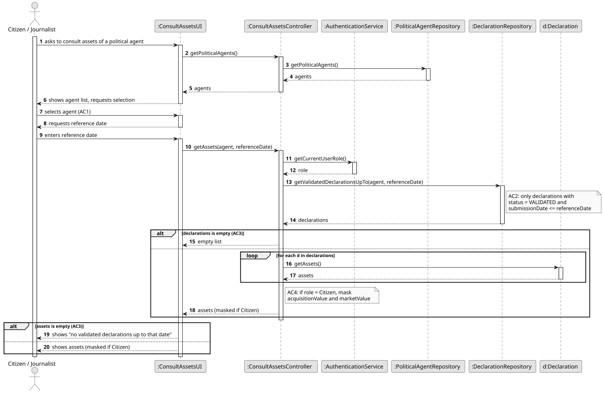
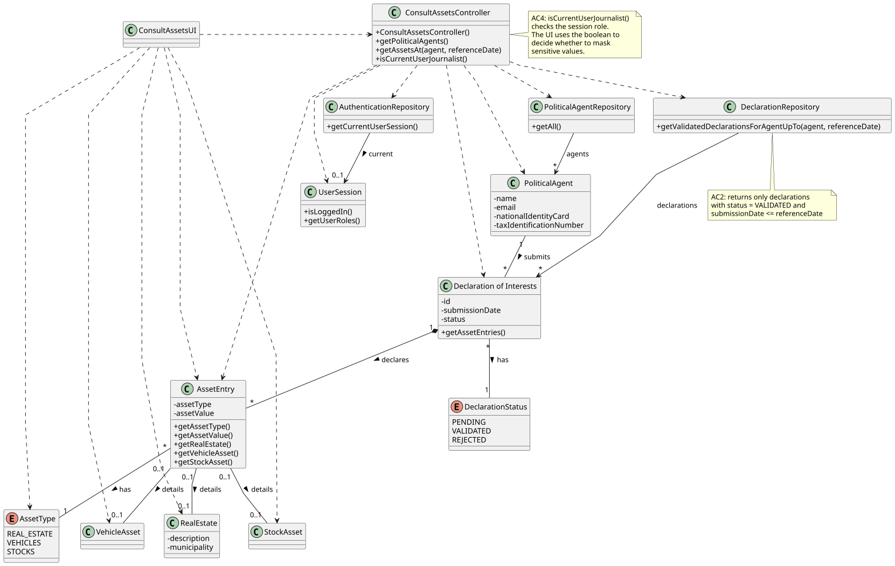

# US11 - Consult the Assets of a Political Agent on a Specific Date

## 3. Design

### 3.1. Rationale

**The rationale grounds on the SSD interactions and the identified input/output data.**

| Interaction ID | Question: Which class is responsible for...                                                              | Answer                          | Justification (with patterns)                                                                                                                                |
|:---------------|:---------------------------------------------------------------------------------------------------------|:--------------------------------|:-------------------------------------------------------------------------------------------------------------------------------------------------------------|
| Step 1         | ...interacting with the actor?                                                                           | ConsultAssetsUI                 | **Pure Fabrication**: the UI has no business responsibilities; it only handles I/O with the Citizen / Journalist.                                            |
| Step 1         | ...coordinating the US?                                                                                  | ConsultAssetsController         | **Controller**: decouples the UI from the domain and orchestrates the use case.                                                                              |
| Step 1         | ...knowing the role of the authenticated user (Citizen vs Journalist)? (AC4)                             | AuthenticationService           | **Pure Fabrication**: the auth service owns user identity and role information; the controller queries it to decide on data masking.                         |
| Step 2         | ...obtaining the list of registered political agents so the actor can pick one? (AC1)                    | PoliticalAgentRepository        | **Pure Fabrication** + **Information Expert**: the repository holds all PoliticalAgent instances and knows how to retrieve them.                             |
| Step 3         | ...obtaining the validated declarations of the selected agent up to the reference date? (AC2)            | DeclarationRepository           | **Pure Fabrication** + **Information Expert**: the repository holds all Declaration instances and is the natural place to filter by agent, status and date.  |
| Step 3         | ...knowing whether a declaration is VALIDATED and was submitted on/before the reference date?            | Declaration                     | **Information Expert**: a Declaration owns its `status` and `submissionDate`.                                                                                |
| Step 3         | ...showing a message when there are no validated declarations up to the reference date? (AC3)            | ConsultAssetsUI                 | **Pure Fabrication**: the empty-result feedback is a presentation concern.                                                                                   |
| Step 3         | ...producing the full list of assets across the agent's validated declarations up to the reference date? | Declaration                     | **Information Expert**: a Declaration aggregates its Asset instances; the controller asks each declaration for its assets.                                   |
| Step 3         | ...exposing the acquisition value, market value, and (when applicable) real-estate description of an asset? | Asset / RealEstate              | **Information Expert**: an Asset owns its acquisition/market values; RealEstate owns its description as a specialisation of Asset.                           |
| Step 4         | ...applying the role-based masking of sensitive financial data before display? (AC4)                     | ConsultAssetsController         | **Controller**: the masking is a use-case-specific transformation that depends on user role; the controller centralises it before passing data to the UI.    |
| Step 4         | ...presenting the (possibly masked) asset list to the actor?                                             | ConsultAssetsUI                 | **Pure Fabrication**: presentation responsibility.                                                                                                           |

### Systematization

According to the taken rationale, the conceptual classes promoted to software classes are:

* PoliticalAgent
* Declaration
* Asset
* RealEstate

Other software classes (i.e. Pure Fabrication) identified:

* ConsultAssetsUI
* ConsultAssetsController
* PoliticalAgentRepository
* DeclarationRepository
* AuthenticationService

## 3.2. Sequence Diagram (SD)

_In this section, it is suggested to present an UML dynamic view representing the sequence of interactions between software objects that allows to fulfill the requirements._

## 3.3. Class Diagram (CD)

_In this section, it is suggested to present an UML static view representing the main related software classes that are involved in fulfilling the requirements as well as their relations, attributes and methods._

