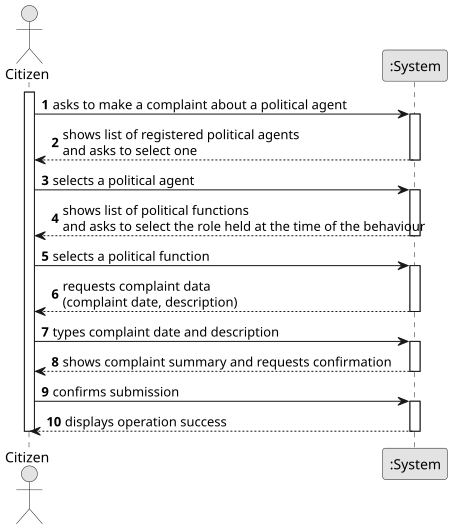

# US12 - Make a Complaint About a Political Agent

## 1. Requirements Engineering

### 1.1. User Story Description

As a citizen, I want to make a complaint about a political agent in a specific role and on a specific date.

### 1.2. Customer Specifications and Clarifications

**From the specifications document:**

> The platform may be used by Ordinary Citizens — persons who have an interest in scrutinising political agents and who can use the platform to report behaviour and processes that they consider to be lacking in transparency.

> The platform supports the analysis of Declarations of Interests submitted by political agents. Its main goal is to detect irregularities such as conflicts of interest and cases of illicit enrichment.

**From the client clarifications:**

> **Question:** What information must a citizen provide when making a complaint?
>
> **Answer:** The citizen must identify the political agent, the specific role (political function) held by the agent at the time of the reported behaviour, and the date on which the behaviour occurred. A description of the complaint must also be provided.

> **Question:** Is the identity of the citizen who submits a complaint kept confidential?
>
> **Answer:** This is still under discussion. For now, the system must record the identity of the citizen who submitted the complaint for internal audit purposes, but it should not be publicly disclosed.

### 1.3. Acceptance Criteria

* **AC1:** The citizen must select a registered political agent from the system.
* **AC2:** The political function (role) held by the agent must be selected from the predefined list of political functions.
* **AC3:** The complaint date must be a valid past or present date; future dates are not allowed.
* **AC4:** A non-empty complaint description must be provided.
* **AC5:** The complaint must be associated with the authenticated citizen and the submission date is recorded automatically by the system.

### 1.4. Found out Dependencies

* There is a dependency on **US01 - Request Registration** and **US02 - Accept/Reject Registration**, as the citizen must be registered and authenticated in the platform before submitting a complaint.

### 1.5. Input and Output Data

**Input Data:**

* Typed data:
    * complaint description
    * complaint date (date on which the reported behaviour occurred)

* Selected data:
    * political agent (from the list of registered political agents)
    * political function held by the agent at the time of the reported behaviour

**Output Data:**

* List of registered political agents
* List of predefined political functions
* Summary of the complaint
* (In)Success of the operation

### 1.6. System Sequence Diagram (SSD)

**_Other alternatives might exist._**

### 1.7. Other Relevant Remarks

* The identity of the citizen who submitted a complaint is recorded internally for audit purposes but is not publicly disclosed.
* The submission date is automatically recorded by the system at the moment the complaint is submitted.
* **[Assumption — pending client confirmation]** A complaint is assumed to target a political agent independently of whether they have validated declarations on the platform. This needs to be confirmed with the client.
