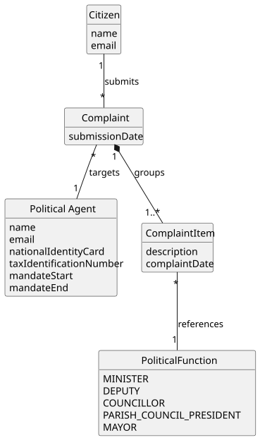

# US12 - Make a Complaint About a Political Agent

## 2. Analysis

### 2.1. Relevant Domain Model Excerpt

### 2.2. Other Remarks

* The `Complaint` is the central concept introduced by this US. It records the citizen's report of behaviours considered to lack transparency, targeting a specific `PoliticalAgent`.
* A `Complaint` is submitted by exactly one `Citizen` and targets exactly one `PoliticalAgent`. The submission date is automatically recorded by the system at the moment of submission.
* A `Complaint` aggregates one or more `ComplaintItem` (grievances). Each `ComplaintItem` records a single reported behaviour with its own `description`, its own `complaintDate` and the `PoliticalFunction` the agent held at the time. This lets the citizen report several behaviours of the same agent within a single complaint (AC6, AC7).
* The `complaintDate` of each grievance (the date on which the reported behaviour occurred) is provided by the citizen and must be a valid past or present date (AC3). It is distinct from the complaint's submission date recorded by the system.
* The `PoliticalFunction` of each grievance represents the role held by the political agent at the time of that behaviour, selected from the predefined enum `{MINISTER, DEPUTY, COUNCILLOR, PARISH_COUNCIL_PRESIDENT, MAYOR}`, consistent with the global domain model.
* All grievances of a complaint refer to the same `PoliticalAgent`; reporting a different agent requires a different `Complaint`.
* A complaint is assumed to be independent of any `DeclarationOfInterests` — it can be submitted about any registered political agent regardless of their declaration history. **This assumption is pending client confirmation.**
* The identity of the submitting `Citizen` is stored internally (associated with the `Complaint`) for audit purposes but is not publicly disclosed.
