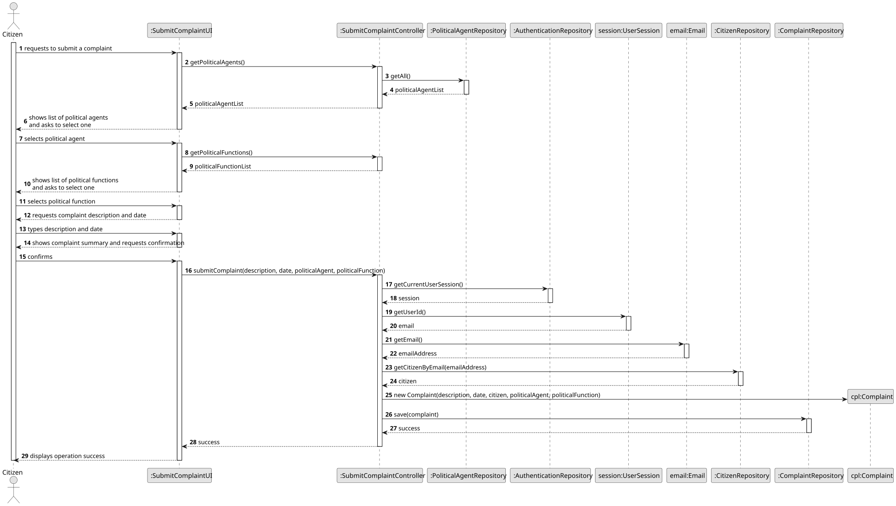
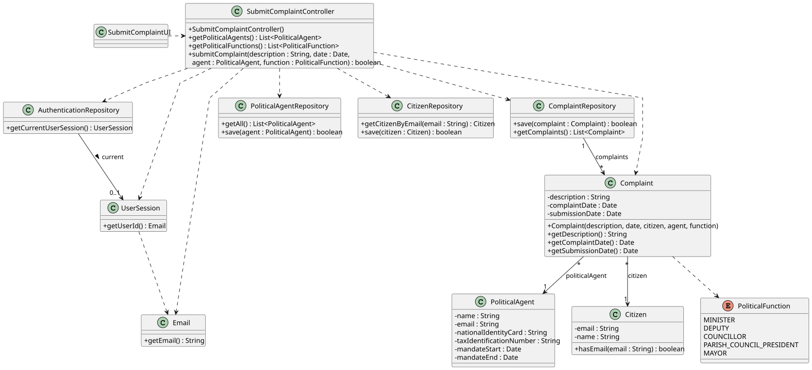

# US12 - Make a Complaint About a Political Agent

## 3. Design

### 3.1. Rationale

**The rationale grounds on the SSD interactions and the identified input/output data.**

| Interaction ID | Question: Which class is responsible for...            | Answer                    | Justification (with patterns)                                                                                                                       |
|:---------------|:-------------------------------------------------------|:--------------------------|:----------------------------------------------------------------------------------------------------------------------------------------------------|
| Step 1         | ...interacting with the actor?                         | SubmitComplaintUI         | **Pure Fabrication**: there is no reason to assign this responsibility to any existing class in the Domain Model.                                   |
|                | ...coordinating the US?                                | SubmitComplaintController | **Controller**                                                                                                                                      |
|                | ...knowing the user using the system?                  | UserSession               | **IE**: cf. A&A component documentation.                                                                                                            |
|                |                                                        | CitizenRepository         | **IE**: knows/has its own Citizens.                                                                                                                 |
|                |                                                        | Citizen                   | **IE**: knows its own data (e.g. email).                                                                                                            |
| Step 2         | ...knowing all registered political agents to show?    | Repositories              | **IE**: Repositories maintains Political Agents.                                                                                                    |
|                |                                                        | PoliticalAgentRepository  | By applying **High Cohesion (HC) + Low Coupling (LC)** on class Repositories, it delegates the responsibility on PoliticalAgentRepository.          |
| Step 3         | ...saving the selected political agent?                | SubmitComplaintUI         | **IE**: is responsible for keeping user selections until submission.                                                                                 |
| Step 4         | ...knowing all predefined political functions to show? | PoliticalFunction         | **IE**: the enum owns its own set of values.                                                                                                        |
| Step 5         | ...saving the selected political function?             | SubmitComplaintUI         | **IE**: is responsible for keeping user selections until submission.                                                                                 |
| Step 6         | ...requesting typed data?                              | SubmitComplaintUI         | **IE**: is responsible for user interactions.                                                                                                       |
| Step 7         | ...saving the inputted data?                           | SubmitComplaintUI         | **IE**: is responsible for keeping the inputted data until submission.                                                                              |
| Step 8         | ...showing all data and requesting confirmation?       | SubmitComplaintUI         | **IE**: is responsible for user interactions.                                                                                                       |
| Step 9         | ...instantiating a new Complaint?                      | SubmitComplaintController | **Controller** + **Creator**: the controller orchestrates the creation and delegates persistence.                                                   |
|                | ...validating all data (local validation)?             | Complaint                 | **IE**: owns its own data and is responsible for its own consistency.                                                                               |
|                | ...recording the submission date automatically?        | Complaint                 | **IE**: owns its `submissionDate`, which is set to `new Date()` on instantiation.                                                             |
|                | ...persisting the new Complaint?                       | ComplaintRepository       | **Pure Fabrication** + **IE**: the repository is responsible for storing and retrieving all Complaint instances.                                    |
| Step 10        | ...informing operation success?                        | SubmitComplaintUI         | **IE**: is responsible for user interactions.                                                                                                       |

### Systematization

According to the taken rationale, the conceptual classes promoted to software classes are:

* Complaint
* PoliticalAgent
* PoliticalFunction
* Citizen

Other software classes (i.e. Pure Fabrication) identified:

* SubmitComplaintUI
* SubmitComplaintController
* Repositories
* PoliticalAgentRepository
* CitizenRepository
* ComplaintRepository
* ApplicationSession
* UserSession

## 3.2. Sequence Diagram (SD)

_This diagram shows the full sequence of interactions between the classes involved in the realization of this user story._

## 3.3. Class Diagram (CD)

_This diagram shows the main related software classes involved in fulfilling the requirements, their relations, attributes and methods._

