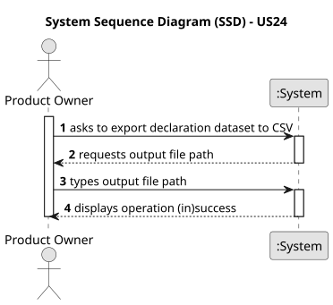

# US24 - Export Declaration Dataset to CSV

## 1. Requirements Engineering

### 1.1. User Story Description

As a Product Owner, I want to extract information from the Declarations of Interest and export it to a .csv file, according to the data set described in Table 2.

### 1.2. Customer Specifications and Clarifications

**From the specifications document:**

> Table 2 describes the variables and their corresponding types that characterize the declaration dataset, one row per declaration (initial, regular/annual, or exceptional).

| Column                          | Type        | Notes                              |
|:--------------------------------|:------------|:-----------------------------------|
| agent id                        | string      | Political agent identifier (NIF)   |
| role                            | categorical | Function held at submission time   |
| declaration type                | categorical | Initial, Regular, Exceptional      |
| declaration date                | date        | yyyy-MM-dd                         |
| declaration id                  | string      | Unique ID of the declaration       |
| institution                     | categorical | Organization of the main position  |
| gross salary                    | numeric     | Annual gross salary reported       |
| side income consulting          | numeric     | Consulting side income; can be zero |
| side income board memberships   | numeric     | Board membership income; can be zero |
| assets in real estate           | numeric     | It can be zero                     |
| assets in vehicles              | numeric     | It can be zero                     |
| assets in stocks                | numeric     | It can be zero                     |

### 1.3. Acceptance Criteria

* **AC1:** Only validated declarations (status = VALIDATED) are included in the export.
* **AC2:** The exported file must have one row per declaration, following the column order of Table 2.
* **AC3:** The `declaration date` must be formatted as `yyyy-MM-dd`.
* **AC4:** `gross salary` is the sum of all gross salary values across all position entries of the declaration.
* **AC5:** `side income consulting` is the sum of all `sideIncomeConsulting` values across all position entries of the declaration.
* **AC5b:** `side income board memberships` is the sum of all `sideIncomeBoardMemberships` values across all position entries of the declaration.
* **AC6:** Each asset column (`assets in real estate`, `assets in vehicles`, `assets in stocks`) is the sum of all asset entries of that category within the declaration.
* **AC7:** The output file path must be specified by the user.
* **AC8:** The first line of the CSV must be a header row with the column names.

### 1.4. Found out Dependencies

* There is a dependency on **US06 - Submit Declaration**, as declarations must first be submitted before they can be exported.
* There is a dependency on **US08 - Validate Declaration**, as only validated declarations are included in the export (AC1).

### 1.5. Input and Output Data

**Input Data:**

* Typed data:
    * output file path (where the .csv file will be saved)

**Output Data:**

* A `.csv` file at the specified path containing one row per validated declaration
* (In)Success of the operation

### 1.6. System Sequence Diagram (SSD)

### 1.7. Other Relevant Remarks

* The exported CSV is consumed by the statistical analysis tools (US13–US18).
* The `role` and `institution` columns are derived from the first position entry of the declaration.
* The column order in the exported CSV matches the column order in Table 2 above.
* If no validated declarations exist, the exported file contains only the header row.
