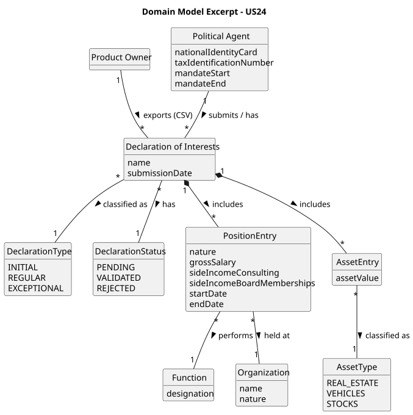

# US24 - Export Declaration Dataset to CSV

## 2. Analysis

### 2.1. Relevant Domain Model Excerpt

The central concept for this US is the `Declaration`, which aggregates all information needed to produce one CSV row. The export logic collects validated declarations from `DeclarationRepository` and derives the required CSV columns from each `Declaration` and its associated entries.

Key mappings from the domain to Table 2 columns (in column order):

* **agent id** — `Declaration.getAgent().getTaxIdentificationNumber()` (the NIF of the political agent).
* **role** — The function designation from the first `PositionEntry` (`positionEntries.get(0).getFunctionDesignation()`).
* **declaration type** — `Declaration.getType().toString()` → "initial", "regular", or "exceptional".
* **declaration date** — `Declaration.getSubmissionDate()` formatted as `yyyy-MM-dd`.
* **declaration id** — A UUID generated at declaration creation time and stored in `Declaration`. Provides a stable unique identifier across exports.
* **institution** — The organization name from the first `PositionEntry` (`positionEntries.get(0).getOrganization().getName()`).
* **gross salary** — Sum of `PositionEntry.getGrossSalary()` across all position entries.
* **side income consulting** — Sum of `PositionEntry.getSideIncomeConsulting()` across all position entries.
* **side income board memberships** — Sum of `PositionEntry.getSideIncomeBoardMemberships()` across all position entries.
* **assets in real estate** — Sum of `AssetEntry.getAssetValue()` where `assetType == REAL_ESTATE`.
* **assets in vehicles** — Sum of `AssetEntry.getAssetValue()` where `assetType == VEHICLES`.
* **assets in stocks** — Sum of `AssetEntry.getAssetValue()` where `assetType == STOCKS`.

Only declarations with status `VALIDATED` are exported (AC1). Pending and rejected declarations are excluded.

### 2.2. Other Remarks

* Adding a `UUID id` field to `Declaration` is required to produce stable `declaration id` values across multiple exports of the same data.
* The `role` and `institution` columns are taken from the first position entry. If a declaration has multiple position entries, only the first is used for these two columns; however, all entries contribute to the summed income and asset columns.
* A new `DeclarationCsvExporter` service class encapsulates the file-writing logic, keeping it separate from the controller.
