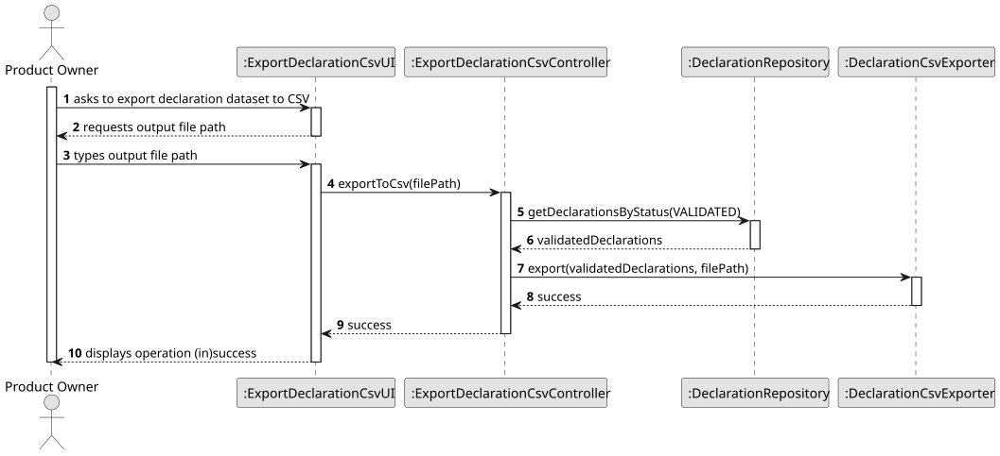
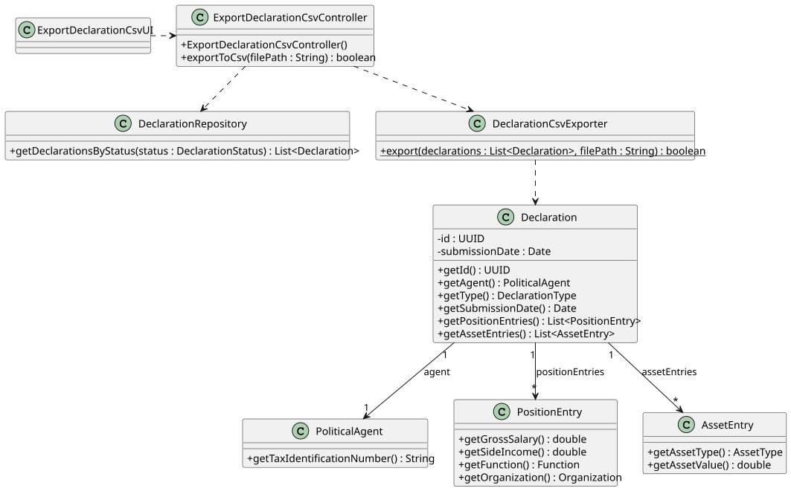

# US24 - Export Declaration Dataset to CSV

## 3. Design

### 3.1. Rationale

**The rationale grounds on the SSD interactions and the identified input/output data.**

| Interaction ID | Question: Which class is responsible for...                                       | Answer                         | Justification (with patterns)                                                                                                              |
|:---------------|:----------------------------------------------------------------------------------|:-------------------------------|:-------------------------------------------------------------------------------------------------------------------------------------------|
| Step 1         | ...interacting with the actor?                                                    | ExportDeclarationCsvUI         | **Pure Fabrication**: the UI has no business responsibilities; it only handles I/O with the Product Owner.                                 |
| Step 1         | ...coordinating the US?                                                           | ExportDeclarationCsvController | **Controller**: decouples the UI from the domain and orchestrates the use case.                                                            |
| Step 2         | ...knowing all validated declarations to export?                                  | DeclarationRepository          | **Information Expert**: the repository holds all Declaration instances and knows how to filter by status.                                  |
| Step 2         | ...extracting the data needed for each CSV row from a Declaration?                | Declaration                    | **Information Expert**: a Declaration owns its own data (position entries, asset entries, agent) and is responsible for deriving CSV values. |
| Step 2         | ...writing the CSV file to disk?                                                  | DeclarationCsvExporter         | **Pure Fabrication**: a dedicated service class isolates file I/O from domain and controller logic.                                        |
| Step 3         | ...informing operation (in)success?                                               | ExportDeclarationCsvUI         | **Information Expert**: the UI is responsible for user interactions.                                                                       |

### Systematization

According to the taken rationale, the conceptual classes promoted to software classes are:

* Declaration
* PoliticalAgent
* PositionEntry
* AssetEntry
* Organization

Other software classes (i.e. Pure Fabrication) identified:

* ExportDeclarationCsvUI
* ExportDeclarationCsvController
* DeclarationRepository
* DeclarationCsvExporter

## 3.2. Sequence Diagram (SD)

## 3.3. Class Diagram (CD)

