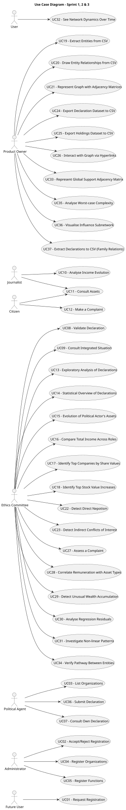

# Use Case Diagram (UCD)

**In the scope of this project, there is a direct relationship of _1 to 1_ between Use Cases (UC) and User Stories (US).**

However, be aware, this is a pedagogical simplification. On further projects and course units there may also exist _1 to N **and/or** N to 1_ relationships between UC and US.

**Insert below the Use Case Diagram in a SVG format**

**For each UC/US, it must be provided evidences of applying main activities of the software development process (requirements, analysis, design, tests and code). Gather those evidences on a separate file for each UC/US and set up a link as suggested below.**

# Use Cases / User Stories

| UC/US | Description                                                              |
|:------|:-------------------------------------------------------------------------|
| US01  | [Request Registration](../US01/US01-README.md)                           |
| US02  | [Accept/reject Registration](../US02/US02-README.md)                     |
| US03  | [List Institutions](../US03/US03-README.md)                              |
| US04  | [Register Institution](../US04/US04-README.md)                           |
| US05  | [Register Functions](../US05/US05-README.md)                             |
| US06  | [Submit Declaration](../US06/US06-README.md)                             |
| US07  | [Consult Own Declaration](../US07/US07-README.md)                        |
| US08  | [Validate Declaration](../US08/US08-README.md)                           |
| US09  | [Consult Integrated Situation](../US09/US09-README.md)                   |
| US10  | [Analyse Income Evolution](../US10/US10-README.md)                       |
| US11  | [Consult Assets](../US11/US11-README.md)                                 |
| US12  | [Make a Complaint](../US12/US12-README.md)                               |
| US13  | [Exploratory Analysis of Declarations](../US13/US13-README.md)           |
| US14  | [Statistical Overview of Declarations](../US14/US14-README.md)           |
| US15  | [Evolution of Political Actor's Assets Over Time](../US15/US15-README.md)|
| US16  | [Compare Total Income Across Roles (Boxplots)](../US16/US16-README.md)   |
| US17  | [Identify Top Companies by Share Values](../US17/US17-README.md)         |
| US18  | [Identify Top Stock Value Increases](../US18/US18-README.md)             |
| US19  | [Extract Entities from CSV](../US19/US19-README.md)                      |
| US20  | [Draw Entity Relationships from CSV](../US20/US20-README.md)             |
| US21  | [Represent Graph with Adjacency Matrices](../US21/US21-README.md)        |
| US22  | [Detect Direct Nepotism](../US22/US22-README.md)                         |
| US23  | [Detect Indirect Conflicts of Interest](../US23/US23-README.md)          |
| US24  | [Export Declaration Dataset to CSV](../US24/US24-README.md)              |
| US25  | [Export Holdings Dataset to CSV](../US25/US25-README.md)                 |
| US26  | [Interact with Graph via Hyperlinks](../US26/US26-README.md)             |
| US27  | [Assess a Complaint](../US27/US27-README.md)                             |
| US28  | [Correlate Remuneration with Asset Types](../US28/US28-README.md)        |
| US29  | [Detect Unusual Wealth Accumulation](../US29/US29-README.md)             |
| US30  | [Analyse Regression Residuals](../US30/US30-README.md)                   |
| US31  | [Investigate Non-linear Patterns](../US31/US31-README.md)               |
| US32  | [See Network Dynamics Over Time](../US32/US32-README.md)                 |
| US33  | [Represent Global Support Adjacency Matrix](../US33/US33-README.md)      |
| US34  | [Verify Pathway Between Entities](../US34/US34-README.md)                |
| US35  | [Analyse Worst-case Complexity](../US35/US35-README.md)                  |
| US36  | [Visualise Influence Subnetwork](../US36/US36-README.md)                 |
| US37  | [Extract Declarations to CSV (Family Relations)](../US37/US37-README.md) |
