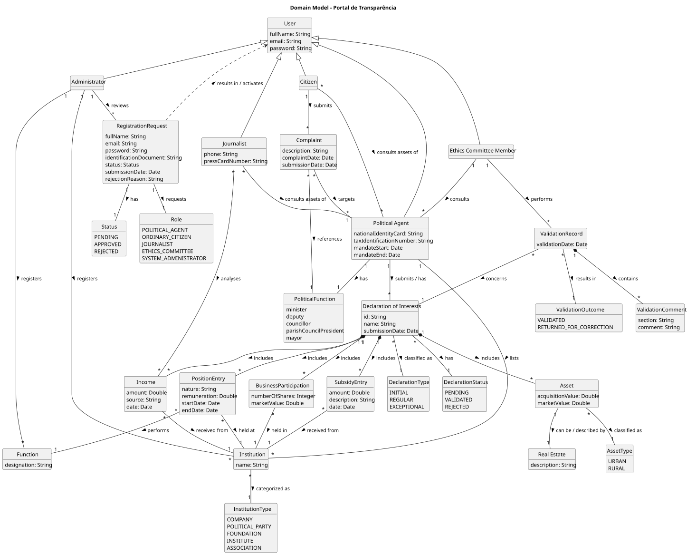

# OO Analysis

The construction process of the domain model is based on the client specifications, especially the nouns (for _concepts_) and verbs (for _relations_) used.

## Rationale to identify domain conceptual classes

To identify domain conceptual classes, start by making a list of candidate conceptual classes inspired by the list of categories suggested in the book "Applying UML and Patterns: An Introduction to Object-Oriented Analysis and Design and Iterative Development".

### _Conceptual Class Category List_

**Business Transactions**

* RegistrationRequest: a request made by a future user to join the platform with a specific role
* DeclarationOfInterests: the formal submission of a political agent's income, positions, assets, and business participations
* ValidationRecord: the act of an Ethics Committee member validating or returning a declaration

**Transaction Line Items**

* PositionEntry: a single professional position (public, private, or social) declared within a declaration
* SubsidyEntry: a single support or subsidy received declared within a declaration
* AssetEntry: a single real estate asset (urban or rural) declared within a declaration
* BusinessParticipation: a single company quota, share, or holding declared within a declaration

**Product/Service related to a Transaction or Transaction Line Item**

* Function: a named function/role that can be performed at an institution (e.g. President, Member, Director)
* Institution: an organisation (company, political party, foundation, institute, or association) where a position is held

**Transaction Records**

* ValidationRecord: records the outcome of a declaration validation by the Ethics Committee
* ValidationComment: a comment attached to a specific section or item of a rejected declaration

**Roles of People or Organizations**

* Role: the platform role of a user (Political Agent, Ordinary Citizen, Journalist, Ethics Committee, System Administrator)
* PoliticalFunction: the political mandate of a political agent (minister, deputy, councillor, mayor, parish council president)

**Places**

* (none identified)

**Noteworthy Events**

* (none identified beyond the transactions above)

**Physical Objects**

* RealEstate: a physical property (urban or rural) associated with an asset entry, identified by description and municipality

**Descriptions of Things**

* DeclarationType: classifies a declaration as initial, regular, or exceptional
* DeclarationStatus: the current state of a declaration (pending, validated, rejected)
* InstitutionType: no longer a separate concept — the institution type is stored as a `type: String` attribute directly on `Institution`
* AssetType: classifies an asset as urban or rural real estate
* ValidationOutcome: the result of a validation (validated or returned for correction)
* Status: the state of a registration request (pending, approved, rejected)

**Catalogs**

* Function: a predefined catalog of registerable functions
* AssetType: a predefined catalog of asset types

**Containers**

* DeclarationOfInterests: contains all declared entries (positions, subsidies, assets, business participations)

**Elements of Containers**

* PositionEntry, SubsidyEntry, AssetEntry, BusinessParticipation

**(Other) Organizations**

* Institution: a company, political party, foundation, institute, or association

**Other (External/Collaborating) Systems**

* (none identified)

**Records of finance, work, contracts, legal matters**

* DeclarationOfInterests: the legal declaration of interests submitted by a political agent
* AssetEntry: record of real estate with estimated value
* BusinessParticipation: record of company holdings with market value
* SubsidyEntry: record of supports and subsidies received

**Financial Instruments**

* BusinessParticipation: quotas, shares, and holdings in companies
* AssetEntry: real estate assets with estimated value

**Documents mentioned/used to perform some work**

* DeclarationOfInterests: the formal document submitted to the platform
* RegistrationRequest: the document submitted to request access to the platform
* Attachment: a supporting document file uploaded alongside a declaration

## Rationale to identify associations between conceptual classes

An association is a relationship between instances of objects that indicates a relevant connection and that is worth remembering, or it is derivable from the List of Common Associations:

* **_A_** is physically or logically part of **_B_**
* **_A_** is physically or logically contained in/on **_B_**
* **_A_** is a description for **_B_**
* **_A_** known/logged/recorded/reported/captured in **_B_**
* **_A_** uses or manages or owns **_B_**
* **_A_** is related with a transaction (item) of **_B_**
* etc.

| Concept (A)               | Association              | Concept (B)              |
|---------------------------|:------------------------:|-------------------------:|
| User                      | has                      | Role                     |
| RegistrationRequest       | requests                 | Role                     |
| RegistrationRequest       | has                      | Status                   |
| RegistrationRequest       | results in               | User                     |
| Administrator             | reviews                  | RegistrationRequest      |
| Administrator             | registers                | Function                 |
| Administrator             | registers                | Institution              |
| PoliticalAgent            | submits                  | DeclarationOfInterests   |
| DeclarationOfInterests    | classified as            | DeclarationType          |
| DeclarationOfInterests    | has                      | DeclarationStatus        |
| DeclarationOfInterests    | includes                 | PositionEntry            |
| DeclarationOfInterests    | includes                 | SubsidyEntry             |
| DeclarationOfInterests    | includes                 | AssetEntry               |
| DeclarationOfInterests    | includes                 | BusinessParticipation    |
| PositionEntry             | held at                  | Institution              |
| PositionEntry             | performs                 | Function                 |
| SubsidyEntry              | received from            | Institution              |
| AssetEntry                | classified as            | AssetType                |
| AssetEntry                | described by             | RealEstate               |
| DeclarationOfInterests    | includes                 | Attachment               |
| EthicsCommitteeMember     | performs                 | ValidationRecord         |
| ValidationRecord          | concerns                 | DeclarationOfInterests   |
| ValidationRecord          | results in               | ValidationOutcome        |
| ValidationRecord          | contains                 | ValidationComment        |
| PoliticalAgent            | has                      | PoliticalFunction        |
| EthicsCommitteeMember     | consults                 | PoliticalAgent           |
| Journalist                | analyses income of       | PoliticalAgent           |
| Journalist                | consults assets of       | PoliticalAgent           |
| Citizen                   | consults assets of       | PoliticalAgent           |

## Rationale to identify concept attributes

Attributes are chosen based on the information that needs to be stored or displayed for each conceptual class, as derived from the client specifications.

| Concept                   | Attributes                                                                 |
|---------------------------|----------------------------------------------------------------------------|
| User                      | name: String, email: String, password: String                              |
| Role                      | designation: String                                                        |
| RegistrationRequest       | name: String, email: String, requestDate: Date                             |
| Status                    | {pending, approved, rejected}                                              |
| PoliticalAgent            | name: String, email: String, nationalIdentityCard: String, taxIdentificationNumber: String, mandateStart: Date, mandateEnd: Date |
| PoliticalFunction         | {minister, deputy, councillor, parishCouncilPresident, mayor}              |
| DeclarationOfInterests    | id: String, name: String, submissionDate: Date                             |
| DeclarationType           | {initial, regular, exceptional}                                            |
| DeclarationStatus         | {pending, validated, rejected}                                             |
| PositionEntry             | remuneration: Double, startDate: Date, endDate: Date                       |
| Function                  | designation: String                                                        |
| Institution               | name: String, type: String                                                 |
| SubsidyEntry              | amount: Double, description: String, date: Date                            |
| AssetEntry                | acquisitionValue: Double, marketValue: Double                              |
| AssetType                 | {urban, rural}                                                             |
| RealEstate                | description: String, municipality: String                                  |
| BusinessParticipation     | numberOfShares: Integer, marketValue: Double                               |
| EthicsCommitteeMember     | name: String, email: String                                                |
| Journalist                | name: String, email: String, phone: String, pressCardNumber: String        |
| Citizen                   | name: String, email: String, nationalIdCardNumber: String                  |
| Administrator             | name: String, email: String                                                |
| ValidationRecord          | validationDate: Date                                                       |
| ValidationOutcome         | {validated, returnedForCorrection}                                         |
| ValidationComment         | comment: String, section: String                                           |
| Income                    | amount: Double, source: String, institution: String, date: Date            |
| Attachment                | fileName: String, uploadDate: Date                                         |

## Domain Model

**Insert the Domain Model diagram in SVG format below.**

